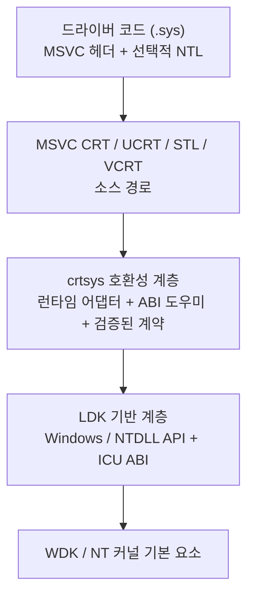

# crtsys

Windows 커널 드라이버(`.sys`)를 위한 현대적인 C++ 개발 플랫폼입니다.

[](https://github.com/ntoskrnl7/crtsys/actions/workflows/cmake.yml)


[영문 문서](./README.md)

`crtsys`는 별도의 STL 포크를 유지하지 않으면서 Microsoft C++ 런타임
생태계(CRT, STL, VCRT, UCRT)를 Windows 커널 드라이버에 통합합니다.
Visual Studio 또는 Build Tools에 설치된 MSVC 헤더와 일부 런타임 소스 경로를
사용하므로, 익숙한 MSVC 개발 환경을 유지하면서 업스트림 STL과의 차이를
최소화할 수 있습니다.

드라이버 코드는 익숙한 MSVC C++ 헤더와 STL 형식을 그대로 사용합니다.
커널 전용 동작이 필요한 경로는 include 검색 경로를 조정하는 호환성
오버레이와 커널 런타임 계층에서 처리합니다. 런타임 의존성은 명시적인 드라이버 테스트 범위,
문서화된 수명주기 동작, IRQL 계약을 갖춘 커널 모드 기반 계층에 매핑됩니다.

`crtsys`의 목표는 커널 개발자가 MSVC 툴체인 및 업스트림 STL과의 정합성을
유지하면서 현대적인 C++ 개발 방식을 사용할 수 있게 하는 것입니다.

지원 범위 표에는 드라이버 테스트로 검증한 기능만 나열합니다. 목록에 없는
API도 동작할 수 있지만 아직 검증된 범위에는 포함되지 않습니다.

## 빠른 시작

일반적인 Visual Studio WDK 드라이버 프로젝트에서는 NuGet 패키지 UI를 통해
`crtsys`를 설치합니다.


NTL 방식의 WDM 드라이버에서는 **NTL WDM**을 선택하고 드라이버 소스에
`ntl::main`을 구현합니다.


NTL 방식의 KMDF 드라이버에서는 **Type of driver**를 **KMDF**로 설정하고
**NTL KMDF**를 선택한 뒤 `ntl::kmdf::main`을 구현합니다.


NTL 방식의 미니필터에서는 **NTL Minifilter**를 선택하고
`ntl::flt::main`을 구현합니다.


Windows Filtering Platform 콜아웃 드라이버에서는 **NTL WFP**를 선택하고
`ntl::main`을 구현합니다. NuGet 패키지가 WFP 대상 정의를 적용하고
`fwpkclnt.lib`를 링크합니다.


| 사용 방식 | 적합한 환경 | 시작 방법 |
| --- | --- | --- |
| NuGet / MSBuild | Visual Studio 또는 Build Tools 기반 WDK 드라이버 프로젝트 | `PackageReference` 또는 `Install-Package crtsys` |
| CMake 사전 빌드 패키지 | 오프라인 환경 또는 버전을 고정한 CI 의존성 | `find_package(crtsys CONFIG REQUIRED)` |
| CMake / CPM | GitHub의 `crtsys`를 사용하는 CMake 기반 드라이버 프로젝트 | `CPMAddPackage("gh:ntoskrnl7/crtsys@<version>")` |

최소 MSBuild/NuGet 구성:

Visual Studio에서 드라이버 프로젝트를 마우스 오른쪽 버튼으로 클릭하고
**Manage NuGet Packages...**를 선택합니다. 사용하는 패키지 소스에서
**crtsys**를 검색하여 WDK 드라이버 프로젝트에 설치한 뒤 평소처럼 빌드합니다.

```xml
<ItemGroup>
  <PackageReference Include="crtsys" Version="<version>" />
</ItemGroup>
```

```powershell
msbuild .\my_driver.vcxproj /restore /p:Configuration=Debug /p:Platform=x64
```

Visual Studio Package Manager Console에서는 다음과 같이 설치합니다.

```powershell
Install-Package crtsys
```

MSBuild 복원을 사용할 수 있는 최신 `PackageReference` 프로젝트에서는
`nuget.exe`가 필수가 아닙니다. Build Tools만 설치된 환경에서도 같은
`msbuild /restore` 경로를 사용할 수 있습니다. 자세한 내용은
[MSBuild/NuGet 빠른 시작](./docs/msbuild-nuget-quickstart.ko-KR.md)을
참조하세요.

별도 드라이버 프로젝트에서 사용하는 최소 CMake/CPM 구성:

해당 드라이버 프로젝트에 `CPM.cmake`를 추가하거나 기존 CPM 부트스트랩을
사용합니다.

```powershell
New-Item -ItemType Directory -Force cmake
Invoke-WebRequest `
  https://github.com/cpm-cmake/CPM.cmake/releases/download/v0.32.0/CPM.cmake `
  -OutFile cmake/CPM.cmake
```

그다음 드라이버의 `CMakeLists.txt`에서 GitHub의 `crtsys`를 사용합니다.

```cmake
include("${CMAKE_CURRENT_LIST_DIR}/cmake/CPM.cmake")

set(CRTSYS_NTL_MAIN ON)
CPMAddPackage("gh:ntoskrnl7/crtsys@<version>")
include(${crtsys_SOURCE_DIR}/cmake/CrtSys.cmake)

crtsys_add_driver(my_driver src/main.cpp)
```

`CRTSYS_NTL_MAIN`을 사용하면 드라이버 코드에서 C++ 진입점 래퍼를 사용할
수 있습니다.

```cpp
#include <ntl/driver>

ntl::status ntl::main(ntl::driver& driver,
                      const std::wstring& registry_path) {
  driver.on_unload([registry_path]() {
    // driver cleanup
  });

  return ntl::status::ok();
}
```

### WDM, KMDF, 미니필터, WFP 드라이버 모델

NuGet 패키지는 WDK 프로젝트의 기존 `DriverType` 설정을 읽습니다. KMDF
프로젝트는 기본적으로 일반 `DriverEntry` 및 `WdfDriverCreate` 경로를
사용합니다. NTL 방식의 진입점을 선호하는 프로젝트는
`CrtSysUseNtlKmdfMain=true`를 설정하고 대신 `ntl::kmdf::main`을 구현할
수 있습니다. 어느 방식을 사용하든 PnP, 전원, 큐, 요청, 객체 수명주기 및
디스패치 처리는 WDF가 계속 담당합니다. crtsys는 WDF 시작 및 언로드 경로
전후에서 C++ 런타임의 수명주기만 관리합니다.

자체 `DriverEntry`를 정의하는 일반 WDM 프로젝트에서는 다음과 같이
설정합니다.

```xml
<CrtSysUseNtlMain>false</CrtSysUseNtlMain>
```

CMake에서는 기존 도우미를 사용하여 표준 KMDF 진입점 또는 선택적인 NTL KMDF
진입점을 선택합니다.

```cmake
crtsys_add_driver(my_kmdf_driver KMDF 1.15 src/main.cpp)
crtsys_add_driver(my_ntl_kmdf_driver KMDF 1.15 NTL src/main.cpp)
```

전체 동작은 [NTL KMDF 드라이버/앱 예제](./examples/kmdf/basic)와
[NTL KMDF API 가이드](./docs/ntl/kmdf.ko-KR.md)에서 확인할 수 있습니다.

파일 시스템 미니필터는 Filter Manager 드라이버로 동작합니다. 모델을
명시적으로 선택하면 crtsys가 `fltmgr.lib`를 링크하고 런타임 경계를 관리한
뒤 `ntl::flt::main`을 호출합니다. 작업 디스패치, 인스턴스, altitude 순서 및
종료 처리는 계속 Filter Manager가 담당합니다.

```cmake
crtsys_add_driver(my_minifilter MINIFILTER NTL src/main.cpp)
```

Visual Studio/NuGet 프로젝트에서는 `CrtSysIsMinifilter=true` 및
`CrtSysUseNtlFltMain=true`를 사용합니다. 자세한 내용은
[NTL 미니필터 예제 모음](./examples/minifilter)과
[API 가이드](./docs/ntl/minifilter.ko-KR.md)를 참조하세요.

Windows Filtering Platform 콜아웃 드라이버는 모델을 명시적으로 선택합니다.
Visual Studio/NuGet 프로젝트에서 **NTL WFP**를 선택하거나
`<CrtSysWdmEntryPoint>NtlWfp</CrtSysWdmEntryPoint>`를 설정합니다. 패키지는
Windows 8 WFP 계약을 적용하고, 아키텍처에 맞는 NDIS 정의를 선택하며,
`fwpkclnt.lib`를 링크하고 `ntl::main` 진입점 래퍼를 사용합니다.

CMake에서는 다음과 같은 도우미를 사용합니다.

```cmake
crtsys_add_driver(my_wfp_callout WFP NTL src/main.cpp)
```

드라이버가 커널 MsQuic NMR 백엔드를 사용한다면 같은 `crtsys_add_driver`
호출에
`KERNEL_MSQUIC`를 추가합니다. 이 옵션은 고정된 헤더, Windows 10
버전 2004 대상 및 `netio.lib`를 함께 선택합니다.

자세한 내용은 [WFP ALE 연결 차단 드라이버/컨트롤러](./examples/wfp/kernel/ale-connect-block),
[한국어 따라하기](./examples/wfp/kernel/ale-connect-block/README.ko-KR.md),
[드라이버 개발자를 위한 WFP 가이드](./docs/ntl/wfp-guide.ko-KR.md),
[형식 안전 API 및 소유권 가이드](./docs/ntl/wfp.ko-KR.md),
[연결 리디렉션 코루틴 TCP 프록시](./examples/wfp/user/connect-redirect),
[Schannel TLS 검사 프록시](./examples/wfp/user/tls-inspection-proxy),
[브라우저 HTTPS 검사 예제](./examples/wfp/user/browser-https-inspection),
[UDP 콘텐츠 필터](./examples/wfp/user/udp-content-filter) 및
[TCP 콘텐츠 필터](./examples/wfp/user/tcp-content-filter) 드라이버/앱 예제,
[콘텐츠 검사 및 프레이밍 가이드](./docs/ntl/inspection.ko-KR.md),
[커널/사용자 네트워크 이중 런타임 가이드](./docs/ntl/network-dual-runtime.ko-KR.md),
[커널 네트워킹 계약 테스트](./test/net/kernel-contracts),
[사용자 모드 TLS 스트림 가이드](./docs/ntl/tls-stream.ko-KR.md),
[WDK 예제 지원 범위](./test/wfp/WDK-SAMPLE-COVERAGE.ko-KR.md)를 참조하세요.

## 런타임 스택



## 지원 개요

| 영역 | 드라이버에서 제공되는 기능 |
| --- | --- |
| C++ 런타임 | 정적 초기화, EH/SEH, RTTI, ABI |
| CRT/UCRT | STL 의존 기능, 수학, 문자 변환 |
| STL | 컨테이너, 범위, 파일 시스템, 형식화/출력, 정규식, 로캘, chrono, 스레딩, 원자적 연산, PMR, 스트림, 난수 |
| 기반 계층 | crtsys 어댑터 + LDK Windows/NTDLL/ICU |
| 검증 근거 | 드라이버 실행 테스트 매트릭스 + cppreference + IRQL 계약 |
| 배포 방식 | NuGet/MSBuild + 사전 빌드 번들 + CPM.cmake |

## 주요 기능

| 기능 | 상태 | 설명 |
| --- | --- | --- |
| C++ 예외 | 드라이버 테스트 완료 | `throw`, `try`/`catch`, 함수 try 블록, `std::exception_ptr` |
| SEH 처리 | 드라이버 테스트 완료 | `__try` / `__except` 경계를 처리하는 C++ 도우미 경로 |
| 정적 초기화 | 드라이버 테스트 완료 | 비지역, 동적 및 MSVC 함수 지역 정적 초기화 |
| 다중 드라이버 컴파일러 TLS | 드라이버 테스트 완료 | crtsys를 링크한 각 드라이버에 서로 다른 MSVC `_tls_index` 값을 부여하여 런타임 TLS 슬롯 충돌 방지 |
| RTTI | 드라이버 테스트 완료 | `typeid`, `dynamic_cast` |
| STL 컨테이너/알고리즘 | 드라이버 테스트 완료 | 컨테이너, 알고리즘, 범위, 스마트 포인터, PMR, 유틸리티 |
| `std::format` / `std::print` | 드라이버 테스트 완료 | 문자열 형식화 및 출력 경로 |
| `std::regex` | 드라이버 테스트 완료 | 정규식 처리 경로 |
| `std::filesystem` | 드라이버 테스트 완료 | 지원 범위 표에 포함된 경로, 디렉터리, 복사, 메타데이터, 시간 및 링크 관련 경로 |
| 동시성 | 드라이버 테스트 완료 | 스레드, 동기화, async/future, 원자적 대기/알림 |
| 로캘 / chrono / charconv | 드라이버 테스트 완료 | 로캘 패싯, 시간대/chrono 경로, 정수 및 부동소수점 문자 변환 |
| NTL 드라이버 도우미 | 드라이버 테스트 완료 | `ntl::main`, 드라이버/장치 도우미, 심볼릭 링크·이벤트·작업 항목 RAII, RPC, IRQL 도우미, 풀 할당자, 스택 확장 |
| `thread_local` | 사용자 변수에는 미지원 | 커널의 GS는 사용자 모드 TEB가 아니라 프로세서별 KPCR을 가리키므로, 사용자가 선언한 `thread_local`은 스레드별 저장소가 되지 않음 |

상세 지원 범위 표는 의도적으로 테스트와 연결되어 있습니다. 컴파일되거나
동작할 가능성이 있는 모든 헤더 및 코드 경로가 아니라, 커널 드라이버 테스트
스위트에서 실제로 실행한 기능을 기록합니다.

## 문서

| 문서 | 주요 내용 |
| --- | --- |
| [아키텍처](./docs/architecture.ko-KR.md) | 런타임 스택, 계층별 책임, 사용 경로 |
| [MSBuild/NuGet 빠른 시작](./docs/msbuild-nuget-quickstart.ko-KR.md) | Visual Studio, Build Tools 전용 환경 및 CI에서의 패키지 사용 |
| [설계 근거](./docs/design-rationale.ko-KR.md) | IRQL, 풀, 스택, 언로드 및 운용 제약 |
| [기능 지원 범위](./docs/feature-coverage.ko-KR.md) | 드라이버에서 검증한 C++/CRT/STL 지원 범위와 알려진 미지원 영역 |
| [NTL API](./docs/ntl/README.ko-KR.md) | 드라이버 도우미 API, 진입점 래퍼, 동기화, 풀 할당자, SEH 도우미 |
| [사용 예제](./docs/usage-examples.ko-KR.md) | 짧은 드라이버 측 NTL 예제 |
| [NTL 예제 드라이버](./examples/ntl-driver) | `ntl::main`, 장치 엔드포인트, 타입 안전 IOCTL, 제거 잠금, 레지스트리 설정, 패시브 실행기 및 풀 기반 PMR을 사용하는 완전한 Visual Studio/NuGet 및 CMake 드라이버 예제 |
| [NTL RPC 예제 드라이버](./examples/ntl-rpc-driver) | 공유 NTL RPC 스키마를 사용하는 완전한 Visual Studio/NuGet 및 CMake 드라이버/앱 예제 |
| [NTL KMDF 예제 모음](./examples/kmdf) | 독립된 제어, PnP, 에코/취소, 참조, 버스, 필터 스택, DMA, USB 및 WMI 프로젝트 |
| [NTL KMDF 기본 예제](./examples/kmdf/basic) | `ntl::kmdf::main`, C++ WDF 컨텍스트, 타입 안전 파일/요청 및 수동 큐 취소, 공통 WDF 객체 유틸리티, 지연 콜백, 패시브 KMDF 콜백에서의 STL 사용 |
| [NTL KMDF PnP 예제](./examples/kmdf/pnp) | 루트 열거 PnP/전원 수명주기, 리소스, 장치 인터페이스, 유휴 정책 및 타입 안전 IOCTL |
| [NTL KMDF 에코 예제](./examples/kmdf/echo) | 타이머 기반 비동기 I/O, 취소 경쟁, 큐 동기화, 재시작 및 언로드에 안전한 소유권 |
| [NTL KMDF 참조 드라이버](./examples/kmdf/reference) | 버전이 지정된 ABI, 핸들별 세션, PnP/전원 상태, 패시브 취소 및 x64/WOW64 클라이언트를 갖춘 프로덕션 지향 소프트웨어 장치 |
| [NTL KMDF 필터 스택 예제](./examples/kmdf/filter-stack) | 요청 전달과 완료, 하위 대상 수명주기 및 관찰 가능한 계층 통과를 구현한 루트 열거 대상과 상위 필터 |
| [NTL KMDF 버스 예제](./examples/kmdf/bus) | 동적 PDO 연결/제거/꺼내기 수명주기와 버스 및 자식 기능 드라이버 사이의 타입 안전 `QUERY_INTERFACE` 계약 |
| [NTL KMDF DMA 템플릿](./examples/kmdf/dma) | 실제 하드웨어용으로 빌드 가능한 PnP 패킷 DMA 트랜잭션, scatter/gather, 공통 버퍼 및 인터럽트 DPC 통합 템플릿 |
| [NTL KMDF USB 템플릿](./examples/kmdf/usb) | 사용자 모드 검사 앱을 포함하며 빌드 가능한 PnP USB 장치/인터페이스/파이프 및 연속 판독기 템플릿 |
| [NTL KMDF WMI 예제](./examples/kmdf/wmi) | MOF 기반 타입 안전 WMI 조회/설정/메서드 공급자, 이벤트 전달 및 `ROOT\\WMI` 사용자 모드 검증기 |
| [NTL 미니필터 예제 모음](./examples/minifilter) | WDK 예제 지원 범위 매핑을 포함한 타입 안전 콜백/컨텍스트, 제어 장치, 통신, MiniSpy 방식 작업 로그, 버퍼 교환 및 MetadataManager 방식 드라이버/앱 예제 |
| [NTL WFP 가이드](./docs/ntl/wfp-guide.ko-KR.md) | WFP 입문자를 위한 개념, 사용자/커널 실행 모델, 타입 안전 콜아웃 판정, 페이로드 경계, TLS/QUIC 검사, 예제 순서 및 검증 방법 |
| [NTL WFP ALE 연결 차단](./examples/wfp/kernel/ale-connect-block) | 선택한 단일 아웃바운드 IPv4 TCP 연결을 차단하고 세션 범위 복구를 입증하며, 영구 그래프의 정합성 조정·상태 확인·제거를 실행하는 용도가 명확한 드라이버/컨트롤러 예제 |
| [NTL WFP 연결 리디렉션](./examples/wfp/user/connect-redirect) | 원래 대상 주소와 불투명한 WFP 리디렉션 레코드를 사용자 모드로 안전하게 전달하고, 코루틴으로 양방향을 중계하며 리디렉션 루프를 방지하는 로컬 TCP 프록시 기반 예제 |
| [NTL WFP TLS 검사 프록시](./examples/wfp/user/tls-inspection-proxy) | 제한된 ClientHello/SNI 식별, 호스트별 인증서 발급/캐시, HTTP/1.1 평문 프레이밍 및 커널 외부에서 소유하는 `inspection_policy`를 갖춘 승인된 연결 리디렉션 및 2구간 Schannel 프록시 |
| [NTL WFP 브라우저 HTTPS 검사](./examples/wfp/user/browser-https-inspection) | 동적 TCP/UDP 리디렉션 정책, Schannel HTTP/1.1·HTTP/2 및 MsQuic HTTP/3 종단 처리, 공유 검사/재작성 정책, WebSocket/gRPC/WebTransport 어댑터 및 제한된 gzip/deflate/Brotli 디코딩을 구현한 독립적인 브라우저 범위 드라이버/서비스 예제 |
| [NTL WFP UDP 콘텐츠 필터](./examples/wfp/user/udp-content-filter) | 완전한 아웃바운드 UDP 데이터그램을 위한 장애 시 차단(fail-closed) 드라이버/정책 코루틴 예제. 허용 시 보관한 복제본을 재주입하고, 차단 시 해당 데이터그램만 폐기 |
| [NTL WFP TCP 콘텐츠 필터](./examples/wfp/user/tcp-content-filter) | 명시적으로 프레이밍한 인바운드 TCP 애플리케이션 메시지를 위한 장애 시 차단(fail-closed) 드라이버/정책 코루틴 예제. 허용 시 정확히 한 프레임을 재개하고, 차단 시 전체 흐름을 폐기 |
| [NTL WFP 커널 예제](./examples/wfp/kernel) | TCP/UDP 콘텐츠 판정, 연결 리디렉션, Schannel TLS 종단 처리, 제어된 브라우저 HTTPS 캡처, MsQuic HTTP/3 및 저수준 WFP 기본 요소 예제의 커널 직접 구현 |
| [NTL WFP 커널 브라우저 HTTPS 검사](./examples/wfp/kernel/browser-https-inspection) | WSK, Schannel HTTP/1.1·HTTP/2, MsQuic HTTP/3, 제한된 캡처, 허용/차단/폐기 및 헤더/본문 재작성 처리를 드라이버 안에 유지하는 독립 예제. 연속 모드에서는 브라우저를 실행하거나 설정·플래그를 변경하지 않고 이미 실행 중인 지정 브라우저 실행 파일을 관찰 |
| [NTL WFP 커널 HTTP/3 검사](./examples/wfp/kernel/http3-inspection) | TLS 1.3, H3 SETTINGS, 제한된 QPACK 요청 파싱, IPv4/IPv6 WFP 승인, 캡처 및 허용/차단 응답을 구현한 제어된 커널 MsQuic NMR 엔드포인트 |
| [NTL 커널 네트워킹 계약](./test/net/kernel-contracts) | 제한된 HTTP/1/2/3, gRPC, QPACK, WebSocket, WebTransport, TLS ClientHello, 직접 실행/오프로딩 정책 및 실행 중인 작업을 안전하게 비우는 처리를 검증하는 합성 드라이버/앱 계약 테스트. 실제 트래픽 예제는 `examples/wfp`에 유지 |
| [CI 드라이버 로드 테스트](./docs/ci-driver-load-tests.ko-KR.md) | 선택적인 자체 호스팅 드라이버 로드/실행 워크플로 |

## 운용 제약

| 구분 | 정책 |
| --- | --- |
| 드라이버 모델 | WDM, KMDF 및 미니필터 프로젝트는 일반 WDK 드라이버로 유지됩니다. KMDF의 PnP/전원/디스패치는 WDF가, 미니필터 콜백과 인스턴스는 Filter Manager가 계속 담당합니다. Verifier, HVCI, 안전한 언로드, 대상 OS 검증 및 페이징 규칙은 여전히 중요합니다. |
| IRQL | 특정 API가 더 넓은 IRQL 계약을 명시하지 않는 한 런타임 기반 C++/CRT/STL 경로는 `PASSIVE_LEVEL`에서 사용해야 합니다. |
| 스택 | 커널 스택은 작습니다. 예외 또는 STL을 많이 사용하는 경로에서는 `ntl::expand_stack`을 사용하세요. |
| TLS | 다중 드라이버 컴파일러 TLS 슬롯 격리를 포함하여 MSVC 함수 지역 정적 변수를 지원합니다. 이 경로는 드라이버 이미지 사이에서 런타임 컴파일러 TLS 슬롯을 격리합니다. 하지만 사용자가 선언한 `thread_local T value`까지 안전해지는 것은 아닙니다. 커널 모드에서 GS 기반 TLS 가정은 스레드별 사용자 모드 TEB가 아니라 프로세서별 KPCR 상태를 가리킵니다. |
| 툴체인 | 서로 호환되는 SDK/WDK 버전을 사용하세요. x86 커널 모드 대상에는 WDK 23H2 이하 버전을 사용해야 합니다. |

## 요구 사항

- Windows 7 이상
- Visual Studio 또는 Build Tools 2017 이상
- 선택한 Visual Studio 툴셋과 호환되는 Windows SDK 및 WDK
- CMake 3.14 이상
- Git

검증된 툴체인에는 Visual Studio 2017, 2019, 2022, 2026과
`10.0.17763.0`, `10.0.18362.0`, `10.0.22000.0`,
`10.0.22621.0`, `10.0.26100.0`, `10.0.28000.0` 등의
WDK/SDK 버전이 포함됩니다.

Visual Studio 2026(`v145`) 검증 범위에는 x64 및 ARM64에서의 SDK/WDK
`10.0.28000.0` 조합이 포함됩니다. WDK `10.0.28000.0`은 x86 커널 모드
라이브러리를 제공하지 않으므로 v145 x86 구성에서는 SDK `10.0.28000.0`과
WDK `10.0.22621.0`을 함께 사용합니다. LDK `0.7.24`와 SDK/WDK
`10.0.28000.0`으로 클린 빌드한 v145 x64 Debug 드라이버는 VM 로드, 실행
및 언로드 검증도 통과했습니다.

Visual Studio 2017은 일부 경로에 필요한 CRT 소스 및 헤더가 부족하므로,
`crtsys`는 해당 툴셋에서 일부 UCXXRT 호환 코드를 사용합니다.

## CMake 빠른 시작

별도의 드라이버 프로젝트를 만들고 `CPM.cmake`를 추가한 뒤 GitHub의
`crtsys`를 사용합니다.

```powershell
New-Item -ItemType Directory -Force cmake
Invoke-WebRequest `
  https://github.com/cpm-cmake/CPM.cmake/releases/download/v0.32.0/CPM.cmake `
  -OutFile cmake/CPM.cmake
```

```cmake
cmake_minimum_required(VERSION 3.14 FATAL_ERROR)

project(my_driver LANGUAGES C CXX)

include("${CMAKE_CURRENT_LIST_DIR}/cmake/CPM.cmake")

set(CRTSYS_NTL_MAIN ON)
CPMAddPackage("gh:ntoskrnl7/crtsys@<version>")
include(${crtsys_SOURCE_DIR}/cmake/CrtSys.cmake)

crtsys_add_driver(my_driver src/main.cpp)
```

`CRTSYS_NTL_MAIN`은 C++ 진입점 래퍼를 활성화합니다. 이 옵션을 켜면
`DriverEntry`를 직접 작성하는 대신 `ntl::main`을 정의합니다.

```cpp
#include <iostream>
#include <string>
#include <ntl/driver>

ntl::status ntl::main(ntl::driver& driver,
                      const std::wstring& registry_path) {
  std::wcout << L"load: " << registry_path << L"\n";

  driver.on_unload([registry_path]() {
    std::wcout << L"unload: " << registry_path << L"\n";
  });

  return ntl::status::ok();
}
```

`CRTSYS_NTL_MAIN`을 끄면 일반 WDK `DriverEntry` 진입점을 유지하고
드라이버를 직접 초기화합니다.

Visual Studio 생성기로 프로젝트를 빌드합니다.

```bat
cmake -S . -B build_x64 -A x64
cmake --build build_x64 --config Debug
```

`crtsys`는 기본적으로 진단용 `KdBreakPoint()` 호출을 활성화합니다.
진단 중단점 없이 빌드하려면 다음과 같이 설정합니다.

```bat
cmake -S . -B build_x64 -A x64 -DCRTSYS_ENABLE_DIAGNOSTIC_BREAKPOINTS=OFF
```

## NuGet 패키지 상세

`crtsys`는 네이티브 MSBuild import와 사전 빌드 드라이버 라이브러리를
포함한 NuGet 패키지를 배포합니다. v142/v143에서는 `x86`, `x64`,
`ARM`, `ARM64`의 `Debug`/`Release` 구성을 제공하고, v145에서는
`x86`, `x64`, `ARM64`를 제공합니다. 패키지 워크플로는 선택한 툴셋이
지원하는 모든 배포 아키텍처에 대해 WDK 사용 프로젝트를 빌드합니다.
저장소에 포함된 스모크 테스트 프로젝트는
[`test/nuget`](./test/nuget)에 있습니다.

사용자 모드 NuGet 프로젝트에는 NTL의 제한된 gzip, RFC 1950 `deflate`,
Brotli HTTP, WebSocket 및 gRPC 변환에 사용하는 고정 버전 zlib/Brotli
백엔드도 제공되며 자동으로 링크됩니다. 여기에는 연속된
`Content-Encoding`을 점진적으로 디코딩하고 다시 인코딩하는 경로도
포함됩니다. 패키지 CI는 모든 배포 툴셋, 아키텍처 및 구성에서 이 코덱 사용
프로젝트를 컴파일하고 링크합니다. x86/x64 작업에서는 입력을 1바이트
단위로 나눈 왕복 테스트도 실행합니다.

드라이버 프로젝트는 이러한 사용자 모드 코덱을 링크하지 않습니다. 대신 NTL
WFP 드라이버 프로젝트에는 별도로 컴파일한 `Z_SOLO` 커널 zlib/Brotli
아카이브가 자동으로 제공됩니다. 따라서
`<ntl/net/kernel/content_codecs>`는 사용자 모드 CRT 객체를 드라이버에
링크하지 않으면서도 속성 하나로 구성하는 동일한 NuGet 사용 방식을
제공합니다. 패키지 CI는 소비자 매트릭스의 모든 `NTL_WFP` 항목에서 이 커널
코덱 API를 컴파일하고 링크합니다.

Visual Studio 속성 페이지에서 **NTL WFP**를 선택하면 NTL 진입점, WFP 정의,
`fwpkclnt.lib` 및 커널 코덱 아카이브도 함께 제공됩니다. CMake에서는
`crtsys_add_driver(target WFP NTL ...)`를 사용하고, 드라이버가
gzip/deflate/Brotli를 직접 사용할 때만 `KERNEL_CONTENT_CODECS`를
추가합니다. 커널 MsQuic을 사용한다면 `KERNEL_MSQUIC`를 추가합니다.
`KERNEL_CONTENT_CODECS`는 드라이버에 안전한 코덱 아카이브를 선택하고,
`KERNEL_MSQUIC`는 고정된 공개 MsQuic ABI, Windows 10 버전 2004 계약 및
NMR 클라이언트 import를 선택합니다. 호환되는
사용자 DLL 또는 커널 NMR 공급자는 명시적으로 배포해야 하는 런타임
의존성으로 남습니다.

Visual Studio/MSBuild 프로젝트용 NuGet 배포물의 이름은
`crtsys.<version>.nupkg`입니다.

## GitHub 릴리스 사전 빌드 번들 상세

GitHub 릴리스는 다음과 같은 오프라인 전용 파일을 배포합니다.

- `crtsys-<version>-prebuilt.zip`: 헤더, 문서, CMake 도우미와 함께,
  MSVC 툴셋별 레이아웃으로 배치된 `x86/x64/ARM/ARM64`
  `Debug`/`Release` 사전 빌드 라이브러리 및 사용자/커널 콘텐츠 코덱.
  v145에서는 ARM을 제외합니다.
- `crtsys-<version>-SHA256SUMS.txt`

사전 빌드 번들은 `crtsys`를 소스에서 가져와 빌드하는 대신, 저장소에
포함하거나 캐시한 런타임 패키지를 사용하려는 CMake 프로젝트를 위한
배포물입니다.

전체 패키징 및 게시 명령은
[`nuget/README.ko-KR.md`](./nuget/README.ko-KR.md)를 참조하세요.

## CMake 설치

CMake 사용 프로젝트는 로컬 CMake 패키지를 설치할 수 있습니다.

```bat
cmake -S . -B build_x64 -A x64 -DCMAKE_INSTALL_PREFIX=%CD%\artifacts\install\crtsys
cmake --build build_x64 --config Release --target crtsys
cmake --install build_x64 --config Release
```

설치 후에는 패키지 구성을 다음과 같이 사용합니다.

```cmake
find_package(crtsys CONFIG REQUIRED PATHS path/to/install-prefix)
crtsys_add_driver(my_driver src/main.cpp)
```

설치 트리는 사전 빌드 릴리스 번들과 같은 네이티브 라이브러리 레이아웃인
`lib/native/<toolset>/<arch>/<config>`를 사용합니다. 예를 들어
`lib/native/v143/x64/Release` 또는 `lib/native/v145/x64/Release`입니다.

다음 명령으로 설치 과정을 스모크 테스트할 수 있습니다.

```powershell
.\scripts\cmake\Test-CrtSysInstall.ps1 -Architecture x64 -Configuration Release
```

`main` 브랜치에서 새 버전을 게시하려면 다음 명령을 사용합니다.

```powershell
.\scripts\release\Prepare-CrtSysRelease.ps1 -Version <version> -Push
```

이 도우미는 `include/.internal/version`을 갱신하고 버전 변경을 커밋한 뒤
일치하는 `v<version>` 태그를 생성하여 커밋과 태그를 모두 푸시합니다.
태그가 푸시되면 `Package` 워크플로가 시작됩니다.

GitHub UI에서도 같은 작업을 수행할 수 있습니다. **Actions**를 열고
**Release**를 선택한 다음 **Run workflow**에서 릴리스 버전을 입력합니다.
워크플로는 버전 변경 커밋과 태그를 생성한 뒤 해당 태그에 대해 `Package`
워크플로를 실행합니다. 브랜치 보호 규칙이 `main` 직접 푸시를 막는 경우에는
로컬 도우미를 사용하거나 먼저 릴리스 규칙을 조정하세요.

## 저장소 빌드

저장소를 복제한 뒤 호스트 아키텍처용 테스트 앱과 드라이버를 빌드합니다.

```bat
git clone https://github.com/ntoskrnl7/crtsys
cd crtsys
test\build.bat
```

특정 대상을 직접 빌드하려면 다음과 같이 실행합니다.

```bat
build.bat test\cmake\app x64 Debug
build.bat test\cmake\driver x64 Debug
build.bat test\cmake\app x64 Release
build.bat test\cmake\driver x64 Release
```

지원되는 모든 아키텍처 및 구성 조합을 빌드하려면 다음 명령을 사용합니다.

```bat
build_all.bat test\cmake\app
build_all.bat test\cmake\driver
```

`build_all.bat`은 빌드를 순차적으로 실행하고 처음 실패한 종료 코드를
반환합니다. 두 번째 인수로 `Debug` 또는 `Release`를 전달하면 해당
구성만 빌드합니다.

일반적인 Debug 출력 경로는 다음과 같습니다.

```text
test\cmake\driver\build_x64\Debug\crtsys_test.sys
test\cmake\app\build_x64\Debug\crtsys_test_app.exe
```

## 테스트 실행

`crtsys_test.sys`는 커널 드라이버입니다. CI에서 빌드 검증은 가능하지만,
테스트 드라이버의 로드와 실행은 Windows 드라이버 테스트 환경에서 수행해야
합니다.

CI 빌드 워크플로와 선택적인 자체 호스팅 드라이버 로드 테스트 경로는
[CI 드라이버 로드 테스트](./docs/ci-driver-load-tests.ko-KR.md)에 정리되어
있습니다.

```bat
sc create CrtSysTest binpath= "C:\path\to\crtsys_test.sys" displayname= "crtsys test" start= demand type= kernel
sc start CrtSysTest

C:\path\to\crtsys_test_app.exe

sc stop CrtSysTest
sc delete CrtSysTest
```

테스트 드라이버는 내부적으로 Google Test를 사용합니다. 결과는 DebugView,
WinDbg 또는 일반적인 커널 디버깅 환경에서 확인하세요.

## 저장소 구조

```text
cmake/             CrtSys.cmake를 포함한 CMake 도우미
examples/          빌드 가능한 작은 예제 프로젝트
include/ntl/       NTL C++ 도우미 헤더
include/.internal/ 내부 버전 및 툴체인 호환성 헤더
src/               crtsys 런타임 및 CRT/STL 호환성 코드
test/cmake/app/    CMake 사용자 모드 테스트 보조 애플리케이션
test/cmake/driver/ CMake 커널 모드 테스트 드라이버
test/nuget/        Visual Studio WDK NuGet 사용 프로젝트 테스트
docs/              추가 문서
```

## 배경

`crtsys`는 UCXXRT 및 KTL 같은 다른 커널 C++ 런타임 프로젝트를 실험한 뒤
만들어졌습니다. 설계 목표는 실제 드라이버 실험에 필요한 Microsoft CRT/STL
기능을 폭넓게 지원하면서 CMake/WDK 작업 흐름을 실용적으로 유지하는
것입니다.

이 프로젝트는 Microsoft CRT/STL 소스를 저장소에 포함된 외부 라이브러리처럼
취급하지 않습니다. 대신 로컬에 설치된 Visual Studio/Build Tools 구성을
사용하고 그 주위에 커널 모드 호환성 코드를 배치합니다. Microsoft에서
제공하는 소스 및 헤더 구성이 불완전한 오래된 툴셋에서는 소규모 호환 코드를
사용합니다.

커널 모드 지원에 더 적합한 경우에는 다음과 같은 독립 구현도 참고합니다.

- [RetrievAL](https://github.com/SpoilerScriptsGroup/RetrievAL)
- [musl](https://github.com/bminor/musl)
- [zpp serializer](https://github.com/eyalz800/serializer)

## 로드맵

- 드라이버에서 검증한 C++ 및 STL 지원 범위를 넓힙니다. 진정한
  `thread_local`은 안전한 커널 모드 설계가 마련되기 전까지 미지원으로
  유지합니다.
- Visual Studio 2017의 호환성 공백을 줄이고 툴셋별 호환 코드를 더 작게
  유지합니다.
- 적합한 테스트 환경을 사용할 수 있는 범위에서 실제 드라이버 로드/실행 CI
  지원 범위를 넓힙니다.
