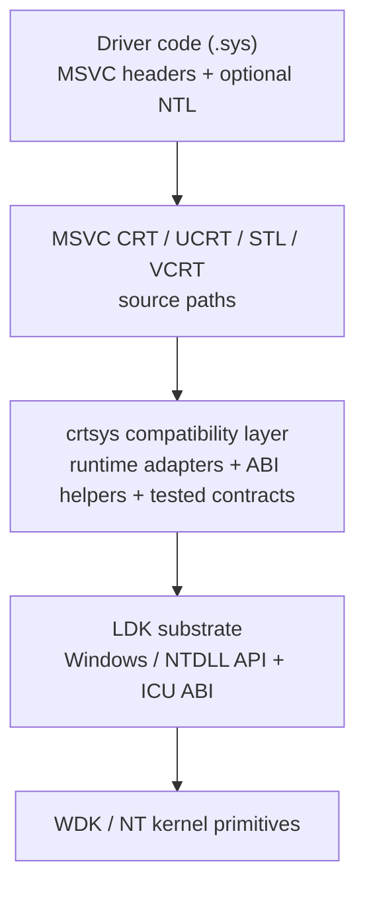

# crtsys

Familiar MSVC C++ runtime and STL experience for Windows kernel drivers (`.sys`).

[](https://github.com/ntoskrnl7/crtsys/actions/workflows/cmake.yml)


[Korean documentation](./docs/ko-kr.md)

`crtsys` brings MSVC CRT/STL/VCRT/UCRT source paths into Windows kernel drivers.
Driver code keeps familiar MSVC C++ headers and STL types while runtime
dependencies are mapped onto a kernel-mode substrate with explicit driver-test
coverage and IRQL contracts.

Listed coverage means "verified by driver tests". It is not an exhaustive
support ceiling for every header or code path that may compile or work.

## Quick Start

| Path | Use when | Start here |
| --- | --- | --- |
| NuGet / MSBuild | Visual Studio or Build Tools WDK driver project | `PackageReference` or `Install-Package crtsys` |
| CMake prebuilt | Offline or pinned CI dependency | `find_package(crtsys CONFIG REQUIRED)` |
| CMake source | Build `crtsys` with the driver | `CPMAddPackage("gh:ntoskrnl7/crtsys@<version>")` |

Minimal MSBuild/NuGet consumer:

```xml
<ItemGroup>
  <PackageReference Include="crtsys" Version="<version>" />
</ItemGroup>
```

```powershell
msbuild .\my_driver.vcxproj /restore /p:Configuration=Debug /p:Platform=x64
```

For Visual Studio Package Manager Console:

```powershell
Install-Package crtsys
```

`nuget.exe` is optional for modern `PackageReference` projects when MSBuild
restore is available. Build Tools-only environments can use the same
`msbuild /restore` path. See the
[MSBuild/NuGet quick start](./docs/msbuild-nuget-quickstart.md).

Minimal CMake consumer:

```cmake
include(cmake/CPM.cmake)

set(CRTSYS_NTL_MAIN ON)
CPMAddPackage("gh:ntoskrnl7/crtsys@<version>")
include(${crtsys_SOURCE_DIR}/cmake/CrtSys.cmake)

crtsys_add_driver(my_driver src/main.cpp)
```

With `CRTSYS_NTL_MAIN`, driver code can use the C++ entry wrapper:

```cpp
#include <ntl/driver>

ntl::status ntl::main(ntl::driver& driver,
                      const std::wstring& registry_path) {
  driver.on_unload([registry_path]() {
    // driver cleanup
  });

  return ntl::status::ok();
}
```

## Runtime Stack



## Capability Map

| Surface | Driver-facing result |
| --- | --- |
| C++ runtime | static init, EH/SEH, RTTI, ABI |
| CRT/UCRT | STL dependencies, math, char conversion |
| STL | containers, ranges, filesystem, format/print, regex, locale, chrono, threading, atomics, PMR, streams, random |
| Substrate | crtsys adapters + LDK Windows/NTDLL/ICU |
| Evidence | driver-run matrix + cppreference + IRQL contracts |
| Packaging | NuGet/MSBuild + prebuilt bundle + CPM.cmake |

## Feature Highlights

| Feature | Status | Notes |
| --- | --- | --- |
| C++ exceptions | Driver-tested | `throw`, `try`/`catch`, function-try-block, `std::exception_ptr` |
| SEH handling | Driver-tested | C++ helper path for `__try` / `__except` boundary handling |
| Static initialization | Driver-tested | non-local, dynamic, and MSVC function-local static initialization |
| RTTI | Driver-tested | `typeid`, `dynamic_cast` |
| STL containers / algorithms | Driver-tested | containers, algorithms, ranges, smart pointers, PMR, utility |
| `std::format` / `std::print` | Driver-tested | formatted string/output paths |
| `std::regex` | Driver-tested | regular expression path |
| `std::filesystem` | Driver-tested | path, directory, copy, metadata, time, link-oriented paths covered by the matrix |
| Concurrency | Driver-tested | thread, synchronization, async/future, atomic wait/notify |
| Locale / chrono / charconv | Driver-tested | locale facets, timezone/chrono paths, integer and floating char conversion |
| NTL driver helpers | Driver-tested | `ntl::main`, driver/device helpers, RPC, IRQL helpers, stack expansion |
| `thread_local` | Not true TLS | Compiler TLS is not exposed as true per-thread kernel TLS |

The detailed matrix is intentionally test-linked: it records features exercised
by the kernel driver test suite, not the full set of headers or code paths that
may compile or work.

## Documentation

| Document | Use it for |
| --- | --- |
| [Architecture](./docs/architecture.md) | Runtime stack, layer responsibilities, consumer paths |
| [MSBuild/NuGet Quick Start](./docs/msbuild-nuget-quickstart.md) | Visual Studio, Build Tools-only, and CI package consumption |
| [Design Rationale](./docs/design-rationale.md) | IRQL, pool, stack, unload, and operational boundaries |
| [Feature Coverage](./docs/feature-coverage.md) | Driver-tested C++/CRT/STL matrix and known gaps |
| [NTL API](./docs/ntl-api.md) | Driver helper APIs, entry wrapper, synchronization, SEH helper |
| [Usage Examples](./docs/usage-examples.md) | Small driver-side NTL examples |
| [CI Driver Load Tests](./docs/ci-driver-load-tests.md) | Optional self-hosted driver load/run workflow |

## Operational Boundaries

| Boundary | Policy |
| --- | --- |
| Driver model | The driver remains a normal WDK driver. Verifier, HVCI, unload safety, target OS validation, and paging rules still matter. |
| IRQL | Runtime-backed C++/CRT/STL paths are `PASSIVE_LEVEL` unless a specific API documents a wider contract. |
| Stack | Kernel stacks are small; use `ntl::expand_stack` for exception-heavy or STL-heavy paths. |
| TLS | MSVC function-local statics are supported. General C++ `thread_local` is not true per-thread TLS. |
| Toolchain | Use matching SDK/WDK versions. Use WDK 23H2 or older for x86 kernel-mode targets. |

## Requirements

- Windows 7 or later
- Visual Studio or Build Tools 2017 or later
- Windows SDK and WDK compatible with the selected Visual Studio toolset
- CMake 3.14 or later
- Git

Tested toolchains include Visual Studio 2017, 2019, and 2022 with WDK/SDK
versions such as `10.0.17763.0`, `10.0.18362.0`, `10.0.22000.0`, and
`10.0.22621.0`.

Visual Studio 2017 has missing CRT source/header pieces for some paths, so
`crtsys` uses selected UCXXRT compatibility code for that toolset.

## CMake Quick Start

Create a driver project, add CPM at `cmake/CPM.cmake`, and add `crtsys`:

```cmake
cmake_minimum_required(VERSION 3.14 FATAL_ERROR)

project(my_driver LANGUAGES C CXX)

include(cmake/CPM.cmake)

set(CRTSYS_NTL_MAIN ON)
CPMAddPackage("gh:ntoskrnl7/crtsys@<version>")
include(${crtsys_SOURCE_DIR}/cmake/CrtSys.cmake)

crtsys_add_driver(my_driver src/main.cpp)
```

`CRTSYS_NTL_MAIN` enables the C++ entry point wrapper. With it enabled, define
`ntl::main` instead of writing `DriverEntry` directly:

```cpp
#include <iostream>
#include <string>
#include <ntl/driver>

ntl::status ntl::main(ntl::driver& driver,
                      const std::wstring& registry_path) {
  std::wcout << L"load: " << registry_path << L"\n";

  driver.on_unload([registry_path]() {
    std::wcout << L"unload: " << registry_path << L"\n";
  });

  return ntl::status::ok();
}
```

If `CRTSYS_NTL_MAIN` is disabled, keep the normal WDK `DriverEntry` entry
point and initialize your driver manually.

Build the project with a Visual Studio generator:

```bat
cmake -S . -B build_x64 -A x64
cmake --build build_x64 --config Debug
```

`crtsys` keeps diagnostic `KdBreakPoint()` calls enabled by default. To build
without those diagnostic breakpoints, configure with:

```bat
cmake -S . -B build_x64 -A x64 -DCRTSYS_ENABLE_DIAGNOSTIC_BREAKPOINTS=OFF
```

## NuGet Package Details

`crtsys` publishes a NuGet package with native MSBuild imports and prebuilt
driver libraries for `x64` and `ARM64` `Debug`/`Release`. The package workflow
also builds WDK consumer projects from the published package; the checked-in
smoke projects live under [`test/nuget`](./test/nuget).

The NuGet distribution is `crtsys.<version>.nupkg` for Visual Studio/MSBuild
projects.

## GitHub Release Prebuilt Bundle Details

GitHub Release publishes these offline-only assets:

- `crtsys-<version>-prebuilt.zip`: headers, docs, CMake helpers,
  and prebuilt `x64/ARM64` `Debug`/`Release` libraries.
- `crtsys-<version>-SHA256SUMS.txt`

The prebuilt bundle is intended for CMake projects that want a checked-in or
cached runtime package instead of fetching and building `crtsys` from source.

For full packaging and publishing command details, see `nuget/README.md`.

## CMake Install

CMake consumers can install a local CMake package:

```bat
cmake -S . -B build_x64 -A x64 -DCMAKE_INSTALL_PREFIX=%CD%\artifacts\install\crtsys
cmake --build build_x64 --config Release --target crtsys
cmake --install build_x64 --config Release
```

Installed consumers can then use the package config:

```cmake
find_package(crtsys CONFIG REQUIRED PATHS path/to/install-prefix)
crtsys_add_driver(my_driver src/main.cpp)
```

The install tree uses the same native library layout as the prebuilt release
bundle: `lib/native/<arch>/<config>`.

The install flow can be smoke-tested with:

```powershell
.\scripts\cmake\Test-CrtSysInstall.ps1 -Architecture x64 -Configuration Release
```

To publish a new version from `main`:

```powershell
.\scripts\release\Prepare-CrtSysRelease.ps1 -Version <version> -Push
```

The helper updates `include/.internal/version`, commits the version bump,
creates the matching `v<version>` tag, and pushes both the commit and tag. The tag
push starts the `Package` workflow.

The same flow is also available from the GitHub UI: open **Actions**,
select **Release**, choose **Run workflow**, and enter the release version. The
workflow creates the version bump commit and tag, then dispatches the `Package`
workflow for that tag. If branch protection blocks direct pushes to `main`, use
the local helper or adjust the release rule first.

## Building This Repository

Clone the repository and build the test app and driver for the host
architecture:

```bat
git clone https://github.com/ntoskrnl7/crtsys
cd crtsys
test\build.bat
```

Build a specific target manually:

```bat
build.bat test\cmake\app x64 Debug
build.bat test\cmake\driver x64 Debug
build.bat test\cmake\app x64 Release
build.bat test\cmake\driver x64 Release
```

Build all supported architecture/configuration combinations:

```bat
build_all.bat test\cmake\app
build_all.bat test\cmake\driver
```

`build_all.bat` runs builds sequentially and returns the first failing exit
code. Pass `Debug` or `Release` as the second argument to build only one
configuration.

Typical Debug outputs:

```text
test\cmake\driver\build_x64\Debug\crtsys_test.sys
test\cmake\app\build_x64\Debug\crtsys_test_app.exe
```

## Running Tests

`crtsys_test.sys` is a kernel driver. Build validation can happen in CI, but
loading and executing the test driver must happen in a Windows driver test
environment.

The CI build workflow and optional self-hosted driver load test path are
documented in [CI driver load tests](./docs/ci-driver-load-tests.md).

```bat
sc create CrtSysTest binpath= "C:\path\to\crtsys_test.sys" displayname= "crtsys test" start= demand type= kernel
sc start CrtSysTest

C:\path\to\crtsys_test_app.exe

sc stop CrtSysTest
sc delete CrtSysTest
```

The test driver uses Google Test internally. Inspect output with DebugView,
WinDbg, or your normal kernel debugging setup.

## Repository Layout

```text
cmake/             CMake helpers, including CrtSys.cmake
include/ntl/       NTL C++ helper headers
include/.internal/ Internal version and toolchain compatibility headers
src/               crtsys runtime and CRT/STL compatibility code
test/cmake/app/    CMake user-mode test companion application
test/cmake/driver/ CMake kernel-mode test driver
test/nuget/        Visual Studio WDK NuGet consumer test project
docs/              Additional documentation
```

## Background

`crtsys` was created after experimenting with other kernel C++ runtime
projects, especially UCXXRT and KTL. The design goal is to keep the CMake/WDK
workflow practical while supporting a substantial Microsoft CRT/STL surface for
real driver experiments.

The project avoids treating the Microsoft CRT/STL source as a vendored library.
Instead, it relies on the locally installed Visual Studio/Build Tools layout
and layers kernel-mode compatibility code around it. For older toolsets where
the Microsoft-provided source/header layout is incomplete, small compatibility
pieces are used.

Several standalone implementations are also referenced where they are a better
fit for kernel-mode support:

- [RetrievAL](https://github.com/SpoilerScriptsGroup/RetrievAL)
- [musl](https://github.com/bminor/musl)
- [zpp serializer](https://github.com/eyalz800/serializer)

## Roadmap

- Expand driver-tested C++ and STL coverage, including investigation of true
  `thread_local` storage.
- Reduce Visual Studio 2017 compatibility gaps and keep toolset-specific
  compatibility code smaller.
- Broaden real driver load/run CI coverage where suitable test environments are
  available.
