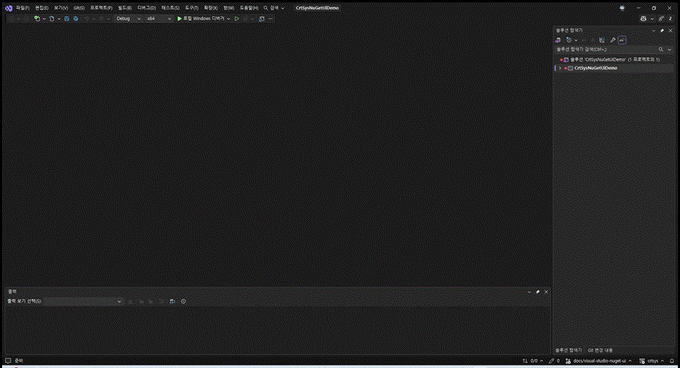
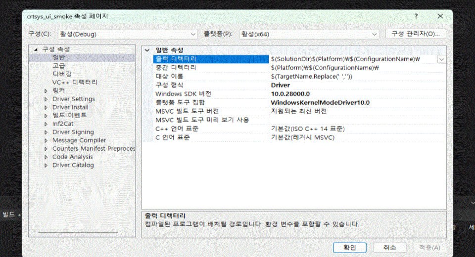
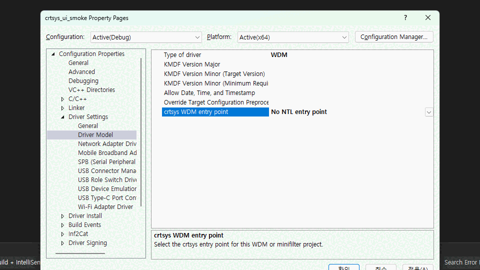
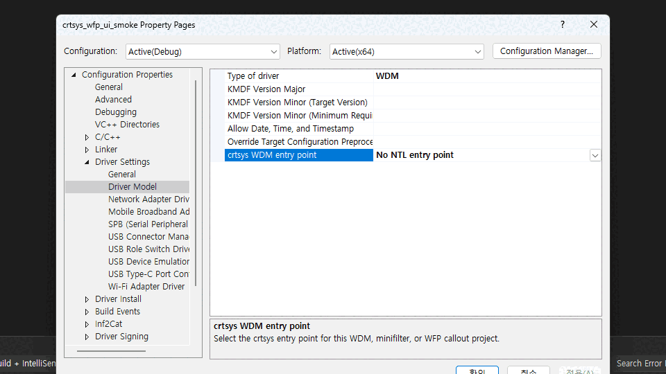
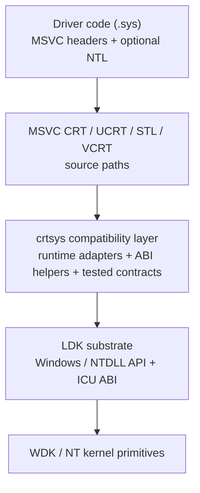

# crtsys

A modern C++ development platform for Windows kernel drivers (`.sys`).

[](https://github.com/ntoskrnl7/crtsys/actions/workflows/cmake.yml)


[Korean documentation](./README.ko-KR.md)

`crtsys` brings the Microsoft C++ runtime ecosystem (CRT, STL, VCRT, and UCRT)
into Windows kernel drivers without maintaining a separate STL fork. It uses
the MSVC headers and selected runtime source paths installed with Visual Studio
or Build Tools, preserving the familiar MSVC development experience while
minimizing divergence from upstream STL.

Driver code keeps the familiar MSVC C++ headers and STL types, while an
include-resolution compatibility overlay and kernel runtime layer adapt the
paths that require kernel-specific behavior. Runtime dependencies are mapped
onto a kernel-mode substrate with explicit driver-test coverage, documented
lifecycle behavior, and IRQL contracts.

The goal of `crtsys` is to let kernel developers use modern C++ development
patterns while staying aligned with the MSVC toolchain and upstream STL.

The coverage matrix lists features verified by driver tests. Unlisted APIs may
also work, but are not yet part of the verified set.

## Quick Start

For the common Visual Studio WDK driver-project workflow, install `crtsys` from
the NuGet package UI:



For an NTL-style WDM driver, select **NTL WDM** and implement `ntl::main` in
the driver source:


For an NTL-style KMDF driver, set **Type of driver** to **KMDF**, select
**NTL KMDF**, and implement `ntl::kmdf::main`:



For an NTL-style minifilter, select **NTL Minifilter** and implement
`ntl::flt::main`:



For a Windows Filtering Platform callout driver, select **NTL WFP** and
implement `ntl::main`. The NuGet package applies the WFP target definitions and
links `fwpkclnt.lib`.



| Path | Use when | Start here |
| --- | --- | --- |
| NuGet / MSBuild | Visual Studio or Build Tools WDK driver project | `PackageReference` or `Install-Package crtsys` |
| vcpkg | CMake or manifest-based Visual Studio/MSBuild project | `vcpkg install crtsys:x64-windows-static` |
| CMake prebuilt | Offline or pinned CI dependency | `find_package(crtsys CONFIG REQUIRED)` |
| CMake / CPM | CMake-based driver project that consumes `crtsys` from GitHub | `CPMAddPackage("gh:ntoskrnl7/crtsys@<version>")` |

Minimal MSBuild/NuGet consumer:

In Visual Studio, right-click the driver project and choose
**Manage NuGet Packages...**. Search for **crtsys** in the package source you
use, install it into the WDK driver project, then build the project normally.

```xml
<ItemGroup>
  <PackageReference Include="crtsys" Version="<version>" />
</ItemGroup>
```

```powershell
msbuild .\my_driver.vcxproj /restore /p:Configuration=Debug /p:Platform=x64
```

For Visual Studio Package Manager Console, the same install is:

```powershell
Install-Package crtsys
```

`nuget.exe` is optional for modern `PackageReference` projects when MSBuild
restore is available. Build Tools-only environments can use the same
`msbuild /restore` path. See the
[MSBuild/NuGet quick start](./docs/msbuild-nuget-quickstart.md).

Minimal CMake/CPM consumer in a separate driver project:

Add `CPM.cmake` to that driver project, or use your existing CPM bootstrap:

```powershell
New-Item -ItemType Directory -Force cmake
Invoke-WebRequest `
  https://github.com/cpm-cmake/CPM.cmake/releases/download/v0.32.0/CPM.cmake `
  -OutFile cmake/CPM.cmake
```

Then consume `crtsys` from GitHub in the driver's `CMakeLists.txt`:

```cmake
include("${CMAKE_CURRENT_LIST_DIR}/cmake/CPM.cmake")

set(CRTSYS_NTL_MAIN ON)
CPMAddPackage("gh:ntoskrnl7/crtsys@<version>")
include(${crtsys_SOURCE_DIR}/cmake/CrtSys.cmake)

crtsys_add_driver(my_driver src/main.cpp)
```

With `CRTSYS_NTL_MAIN`, driver code can use the C++ entry wrapper:

```cpp
#include <ntl/driver>

ntl::status ntl::main(ntl::driver& driver,
                      const std::wstring& registry_path) {
  driver.on_unload([registry_path]() {
    // driver cleanup
  });

  return ntl::status::ok();
}
```

### WDM, KMDF, minifilter, and WFP driver models

The NuGet package reads the WDK project's existing `DriverType` setting. A
KMDF project uses its normal `DriverEntry` and `WdfDriverCreate` by default.
Projects that prefer an NTL-style entry can set
`CrtSysUseNtlKmdfMain=true` and implement `ntl::kmdf::main` instead. Both modes
leave PnP, power, queue, request, object lifetime, and dispatch processing with
WDF; crtsys only brackets the WDF startup/unload path with C++ runtime lifetime.

For a regular WDM project that defines its own `DriverEntry`, set:

```xml
<CrtSysUseNtlMain>false</CrtSysUseNtlMain>
```

For CMake, select standard KMDF or the optional NTL KMDF entry on the existing
helper:

```cmake
crtsys_add_driver(my_kmdf_driver KMDF 1.15 src/main.cpp)
crtsys_add_driver(my_ntl_kmdf_driver KMDF 1.15 NTL src/main.cpp)
```

See the complete [NTL KMDF driver/app sample](./examples/kmdf/basic)
and the [NTL KMDF API guide](./docs/ntl/kmdf.md).

File-system minifilters remain Filter Manager drivers. Select the model
explicitly; crtsys links `fltmgr.lib`, owns the runtime boundary, and calls
`ntl::flt::main`, while Filter Manager continues to own operation dispatch,
instances, altitude ordering, and teardown:

```cmake
crtsys_add_driver(my_minifilter MINIFILTER NTL src/main.cpp)
```

Visual Studio/NuGet projects use `CrtSysIsMinifilter=true` and
`CrtSysUseNtlFltMain=true`. See the
[NTL minifilter sample catalog](./examples/minifilter) and
[API guide](./docs/ntl/minifilter.md).

Windows Filtering Platform callout drivers select the model explicitly. In
Visual Studio/NuGet projects, select **NTL WFP**, or set
`<CrtSysWdmEntryPoint>NtlWfp</CrtSysWdmEntryPoint>`. The package applies the
Windows 8 WFP contract, selects the architecture-appropriate NDIS definitions,
links `fwpkclnt.lib`, and uses the `ntl::main` entry wrapper.

CMake consumers use the equivalent helper:

```cmake
crtsys_add_driver(my_wfp_callout WFP NTL src/main.cpp)
```

If that driver uses the kernel MsQuic NMR backend, add `KERNEL_MSQUIC` to the
same call. It selects the pinned headers, Windows 10 version-2004 target, and
`netio.lib` together.

See the [WFP ALE connect-block driver/controller](./examples/wfp/kernel/ale-connect-block),
its [Korean walkthrough](./examples/wfp/kernel/ale-connect-block/README.ko-KR.md), the
[WFP guide for driver developers](./docs/ntl/wfp-guide.md), the
[typed API and ownership guide](./docs/ntl/wfp.md), the
 [connect-redirect coroutine TCP proxy](./examples/wfp/user/connect-redirect), the
 [Schannel TLS inspection proxy](./examples/wfp/user/tls-inspection-proxy), the
 [separate browser HTTPS inspection example](./examples/wfp/user/browser-https-inspection), the
 [UDP content-filter](./examples/wfp/user/udp-content-filter) and
[TCP content-filter](./examples/wfp/user/tcp-content-filter) driver/app samples, the
[content inspection and framing guide](./docs/ntl/inspection.md), the
[kernel/user network dual-runtime guide](./docs/ntl/network-dual-runtime.md), the
[kernel networking contract test](./test/net/kernel-contracts), the
[user-mode TLS stream guide](./docs/ntl/tls-stream.md), and the
[WDK sample coverage map](./test/wfp/WDK-SAMPLE-COVERAGE.md).

## Runtime Stack


```mermaid
flowchart TD
    Driver["Driver code (.sys)<br/>MSVC headers + optional NTL"]
    Runtime["MSVC CRT / UCRT / STL / VCRT<br/>source paths"]
    CrtSys["crtsys compatibility layer<br/>runtime adapters + ABI helpers + tested contracts"]
    LDK["LDK substrate<br/>Windows / NTDLL API + ICU ABI"]
    Kernel["WDK / NT kernel primitives"]

    Driver --> Runtime --> CrtSys --> LDK --> Kernel
```

## Capability Map

| Surface | Driver-facing result |
| --- | --- |
| C++ runtime | static init, EH/SEH, RTTI, ABI |
| CRT/UCRT | STL dependencies, math, char conversion |
| STL | containers, ranges, filesystem, format/print, regex, locale, chrono, threading, atomics, PMR, streams, random |
| Substrate | crtsys adapters + LDK Windows/NTDLL/ICU |
| Evidence | driver-run matrix + cppreference + IRQL contracts |
| Packaging | NuGet/MSBuild + prebuilt bundle + CPM.cmake |

## Feature Highlights

| Feature | Status | Notes |
| --- | --- | --- |
| C++ exceptions | Driver-tested | `throw`, `try`/`catch`, function-try-block, `std::exception_ptr` |
| SEH handling | Driver-tested | C++ helper path for `__try` / `__except` boundary handling |
| Static initialization | Driver-tested | non-local, dynamic, and MSVC function-local static initialization |
| Multi-driver compiler TLS | Driver-tested | distinct MSVC `_tls_index` values across crtsys-linked drivers so runtime TLS slots do not collide |
| RTTI | Driver-tested | `typeid`, `dynamic_cast` |
| STL containers / algorithms | Driver-tested | containers, algorithms, ranges, smart pointers, PMR, utility |
| `std::format` / `std::print` | Driver-tested | formatted string/output paths |
| `std::regex` | Driver-tested | regular expression path |
| `std::filesystem` | Driver-tested | path, directory, copy, metadata, time, link-oriented paths covered by the matrix |
| Concurrency | Driver-tested | thread, synchronization, async/future, atomic wait/notify |
| Locale / chrono / charconv | Driver-tested | locale facets, timezone/chrono paths, integer and floating char conversion |
| NTL driver helpers | Driver-tested | `ntl::main`, driver/device helpers, symbolic link/event/work item RAII, RPC, IRQL helpers, pool allocators, stack expansion |
| `thread_local` | Unsupported for user variables | Kernel GS is processor-local KPCR, not user-mode TEB; user-declared `thread_local` would not be per-thread storage |

The detailed matrix is intentionally test-linked: it records features exercised
by the kernel driver test suite, not the full set of headers or code paths that
may compile or work.

## Documentation

| Document | Use it for |
| --- | --- |
| [Architecture](./docs/architecture.md) | Runtime stack, layer responsibilities, consumer paths |
| [MSBuild/NuGet Quick Start](./docs/msbuild-nuget-quickstart.md) | Visual Studio, Build Tools-only, and CI package consumption |
| [Design Rationale](./docs/design-rationale.md) | IRQL, pool, stack, unload, and operational boundaries |
| [Feature Coverage](./docs/feature-coverage.md) | Driver-tested C++/CRT/STL matrix and known gaps |
| [NTL API](./docs/ntl/README.md) | Driver helper APIs, entry wrapper, synchronization, pool allocators, SEH helper |
| [Usage Examples](./docs/usage-examples.md) | Small driver-side NTL examples |
| [NTL sample driver](./examples/ntl-driver) | Complete Visual Studio/NuGet and CMake driver sample using `ntl::main`, device endpoint, typed IOCTLs, remove lock, registry config, passive executor, and pool-backed PMR |
| [NTL RPC sample driver](./examples/ntl-rpc-driver) | Complete Visual Studio/NuGet and CMake driver/app pair using the shared NTL RPC schema |
| [NTL KMDF samples](./examples/kmdf) | Independent control, PnP, echo/cancel, reference, bus, filter-stack, DMA, USB, and WMI projects |
| [NTL KMDF basic sample](./examples/kmdf/basic) | `ntl::kmdf::main`, C++ WDF contexts, typed file/request and manual-queue cancellation, common WDF object utilities, deferred callbacks, and STL in passive KMDF callbacks |
| [NTL KMDF PnP sample](./examples/kmdf/pnp) | Root-enumerated PnP/power lifecycle, resources, device interface, idle policy, and typed IOCTL |
| [NTL KMDF echo sample](./examples/kmdf/echo) | Timer-backed asynchronous I/O, cancellation races, queue synchronization, restart, and unload-safe ownership |
| [NTL KMDF reference driver](./examples/kmdf/reference) | Production-oriented software device with a versioned ABI, per-handle sessions, PnP/power state, passive cancellation, and x64/WOW64 clients |
| [NTL KMDF filter-stack sample](./examples/kmdf/filter-stack) | Root-enumerated target and upper filter with request forwarding, completion, lower-target lifetime, and observable layer traversal |
| [NTL KMDF bus sample](./examples/kmdf/bus) | Dynamic PDO plug/remove/eject lifecycle and a typed `QUERY_INTERFACE` contract between bus and child function drivers |
| [NTL KMDF DMA template](./examples/kmdf/dma) | Buildable PnP packet-DMA transaction, scatter/gather, common-buffer, and interrupt-DPC integration template for real hardware |
| [NTL KMDF USB template](./examples/kmdf/usb) | Buildable PnP USB device/interface/pipe and continuous-reader template with a user-mode inspection app |
| [NTL KMDF WMI sample](./examples/kmdf/wmi) | MOF-backed typed WMI query/set/method providers, event delivery, and a `ROOT\\WMI` user-mode verifier |
| [NTL minifilter samples](./examples/minifilter) | Independent typed callback/context, control-device, communication, MiniSpy-style operation-log, swapped-buffer, and MetadataManager-style driver/app examples with WDK sample-coverage mapping |
| [NTL WFP guide](./docs/ntl/wfp-guide.md) | Concepts, user/kernel execution models, typed callout decisions, payload boundaries, TLS/QUIC inspection, sample order, and verification for developers new to WFP |
| [NTL WFP ALE connect-block](./examples/wfp/kernel/ale-connect-block) | A purpose-named driver/controller sample that blocks one selected outbound IPv4 TCP connection, proves session-scoped recovery, and exercises persistent graph reconcile, health, and uninstall |
| [NTL WFP connect-redirect](./examples/wfp/user/connect-redirect) | A local TCP proxy foundation that safely hands the original destination and opaque WFP redirect records to user mode, relays both directions with coroutines, and prevents redirect loops |
| [NTL WFP TLS inspection-proxy](./examples/wfp/user/tls-inspection-proxy) | An authorized connect-redirect and two-leg Schannel proxy with bounded ClientHello/SNI identity selection, per-host certificate issuance/cache, HTTP/1.1 plaintext framing, and an owning `inspection_policy` outside the kernel |
| [NTL WFP browser HTTPS inspection](./examples/wfp/user/browser-https-inspection) | An independent browser-scoped driver/service example with dynamic TCP and UDP redirect policy, Schannel HTTP/1.1·HTTP/2 and MsQuic HTTP/3 termination, one shared inspection/rewrite policy, WebSocket/gRPC/WebTransport adapters, and bounded gzip/deflate/Brotli decoding |
| [NTL WFP UDP content-filter](./examples/wfp/user/udp-content-filter) | A fail-closed driver/policy-coroutine sample for complete outbound UDP datagrams; permit reinjects the retained clone and block discards only that datagram |
| [NTL WFP TCP content-filter](./examples/wfp/user/tcp-content-filter) | A fail-closed driver/policy-coroutine sample for explicitly framed inbound TCP application messages; permit resumes exactly one frame and block drops the whole flow |
| [NTL WFP kernel examples](./examples/wfp/kernel) | Direct kernel counterparts for TCP/UDP content decisions, connect redirect, Schannel TLS termination, controlled browser HTTPS capture, and MsQuic HTTP/3, plus the low-level WFP primitive samples |
| [NTL WFP kernel browser HTTPS inspection](./examples/wfp/kernel/browser-https-inspection) | A separate example that keeps WSK, Schannel HTTP/1.1·HTTP/2, MsQuic HTTP/3, bounded capture, permit/block/drop, and header/body rewrite processing in the driver; continuous mode observes an already-running exact browser executable without launching it or changing browser settings or flags |
| [NTL WFP kernel HTTP/3 inspection](./examples/wfp/kernel/http3-inspection) | A controlled kernel MsQuic NMR endpoint with TLS 1.3, H3 SETTINGS, bounded QPACK request parsing, IPv4/IPv6 WFP authorization, capture, and allow/block responses |
| [NTL kernel networking contracts](./test/net/kernel-contracts) | Synthetic driver/app contract test for bounded HTTP/1/2/3, gRPC, QPACK, WebSocket, WebTransport, TLS ClientHello, direct/offloaded policy, and drainable execution; real traffic examples remain under `examples/wfp` |
| [CI Driver Load Tests](./docs/ci-driver-load-tests.md) | Optional self-hosted driver load/run workflow |

## Operational Boundaries

| Boundary | Policy |
| --- | --- |
| Driver model | WDM, KMDF, and minifilter projects remain normal WDK drivers. KMDF retains WDF ownership of PnP/power/dispatch; Filter Manager retains minifilter callback and instance ownership. Verifier, HVCI, unload safety, target OS validation, and paging rules still matter. |
| IRQL | Runtime-backed C++/CRT/STL paths are `PASSIVE_LEVEL` unless a specific API documents a wider contract. |
| Stack | Kernel stacks are small; use `ntl::expand_stack` for exception-heavy or STL-heavy paths. |
| TLS | MSVC function-local statics are supported, including multi-driver compiler TLS slot isolation. That supported path isolates runtime compiler TLS slots between driver images. It does not make user-declared `thread_local T value` safe: in kernel mode the GS-based TLS assumption points at processor-local KPCR state, not a per-thread user-mode TEB. |
| Toolchain | Use matching SDK/WDK versions. Use WDK 23H2 or older for x86 kernel-mode targets. |

## Requirements

- Windows 7 or later
- Visual Studio or Build Tools 2017 or later
- Windows SDK and WDK compatible with the selected Visual Studio toolset
- CMake 3.14 or later
- Git

Tested toolchains include Visual Studio 2017, 2019, 2022, and 2026 with WDK/SDK
versions such as `10.0.17763.0`, `10.0.18362.0`, `10.0.22000.0`,
`10.0.22621.0`, `10.0.26100.0`, and `10.0.28000.0`.

The Visual Studio 2026 (`v145`) validation covers SDK/WDK `10.0.28000.0`
on x64 and ARM64. Because WDK `10.0.28000.0` does not provide x86
kernel-mode libraries, the v145 x86 configuration uses SDK `10.0.28000.0`
with WDK `10.0.22621.0`. A clean v145 x64 Debug driver built with LDK
`0.7.24` and SDK/WDK `10.0.28000.0` also passed VM load, run, and unload
validation.

Visual Studio 2017 has missing CRT source/header pieces for some paths, so
`crtsys` uses selected UCXXRT compatibility code for that toolset.

## CMake Quick Start

Create a separate driver project, add `CPM.cmake` to that project, and consume
`crtsys` from GitHub:

```powershell
New-Item -ItemType Directory -Force cmake
Invoke-WebRequest `
  https://github.com/cpm-cmake/CPM.cmake/releases/download/v0.32.0/CPM.cmake `
  -OutFile cmake/CPM.cmake
```

```cmake
cmake_minimum_required(VERSION 3.14 FATAL_ERROR)

project(my_driver LANGUAGES C CXX)

include("${CMAKE_CURRENT_LIST_DIR}/cmake/CPM.cmake")

set(CRTSYS_NTL_MAIN ON)
CPMAddPackage("gh:ntoskrnl7/crtsys@<version>")
include(${crtsys_SOURCE_DIR}/cmake/CrtSys.cmake)

crtsys_add_driver(my_driver src/main.cpp)
```

`CRTSYS_NTL_MAIN` enables the C++ entry point wrapper. With it enabled, define
`ntl::main` instead of writing `DriverEntry` directly:

```cpp
#include <iostream>
#include <string>
#include <ntl/driver>

ntl::status ntl::main(ntl::driver& driver,
                      const std::wstring& registry_path) {
  std::wcout << L"load: " << registry_path << L"\n";

  driver.on_unload([registry_path]() {
    std::wcout << L"unload: " << registry_path << L"\n";
  });

  return ntl::status::ok();
}
```

If `CRTSYS_NTL_MAIN` is disabled, keep the normal WDK `DriverEntry` entry
point and initialize your driver manually.

Build the project with a Visual Studio generator:

```bat
cmake -S . -B build_x64 -A x64
cmake --build build_x64 --config Debug
```

`crtsys` keeps diagnostic `KdBreakPoint()` calls enabled by default. To build
without those diagnostic breakpoints, configure with:

```bat
cmake -S . -B build_x64 -A x64 -DCRTSYS_ENABLE_DIAGNOSTIC_BREAKPOINTS=OFF
```

## NuGet Package Details

`crtsys` publishes a NuGet package with native MSBuild imports and prebuilt
driver libraries for `x86`, `x64`, `ARM`, and `ARM64` `Debug`/`Release` on
v142/v143, and `x86`, `x64`, and `ARM64` on v145. The package workflow builds
WDK consumer projects for every packaged architecture that the selected toolset
supports. The checked-in smoke projects live under [`test/nuget`](./test/nuget).

User-mode NuGet consumers also receive and automatically link the pinned
zlib/Brotli backends used by NTL's bounded gzip, RFC 1950 `deflate`, and
Brotli HTTP, WebSocket, and gRPC transforms, including incremental chained
`Content-Encoding` decode/re-encode. Package CI compiles and links this codec
consumer across every packaged toolset, architecture, and configuration;
x86/x64 jobs also execute one-byte-split round trips. Driver projects do not
link these user-mode codecs. NTL WFP driver projects instead automatically
receive the separately compiled `Z_SOLO` kernel zlib/Brotli archives, so
`<ntl/net/kernel/content_codecs>` has the same one-property NuGet experience
without linking user-mode CRT objects into a driver. Package CI compiles and
links that kernel codec surface in every `NTL_WFP` consumer matrix entry.

Selecting **NTL WFP** in the Visual Studio property page also supplies the NTL
entry point, WFP definitions, `fwpkclnt.lib`, and the kernel codec archives.
For CMake, use `crtsys_add_driver(target WFP NTL ...)` and add
`KERNEL_CONTENT_CODECS` only when the driver directly uses
gzip/deflate/Brotli. Add `KERNEL_MSQUIC` when it uses kernel MsQuic. Those
options select the driver-safe codec archives, or the pinned public MsQuic
ABI, Windows 10 version-2004 contract, and NMR client import, respectively.
The compatible user DLL or kernel NMR provider remains an explicit runtime
deployment dependency.

The NuGet distribution is `crtsys.<version>.nupkg` for Visual Studio/MSBuild
projects.

## GitHub Release Prebuilt Bundle Details

GitHub Release publishes these offline-only assets:

- `crtsys-<version>-prebuilt.zip`: headers, docs, CMake helpers,
  and prebuilt `x86/x64/ARM/ARM64` `Debug`/`Release` libraries under an MSVC
  toolset-specific layout, including user and kernel content codecs, with ARM
  omitted for v145.
- `crtsys-<version>-SHA256SUMS.txt`

The prebuilt bundle is intended for CMake projects that want a checked-in or
cached runtime package instead of fetching and building `crtsys` from source.

## vcpkg Overlay Port

The first-party overlay under [`vcpkg/ports`](./vcpkg/ports) installs the
prebuilt release for one triplet architecture while retaining the supported
MSVC toolset variants. crtsys requires a Windows desktop static-CRT triplet:

Published versions are available from the repository's `vcpkg-registry`
branch. Its current stable baseline is
`bde54df486d558f12e274a5c2c12e92a6e095d46`; see the
[vcpkg guide](./vcpkg/README.md) for the manifest configuration. A source
checkout can instead use the overlay directly:

```powershell
vcpkg install crtsys:x64-windows-static `
  --overlay-ports=path\to\crtsys\vcpkg\ports
```

CMake consumers use the installed `crtsys` package normally. Visual
Studio/MSBuild consumers can additionally import the installed
`share/crtsys/msbuild/crtsys-vcpkg.targets` bridge to retain the existing WDM,
KMDF, minifilter, and WFP entry-point property pages. Run `vcpkg install` before
opening the solution for the first time, then reload Visual Studio after adding
the import. See the [vcpkg guide](./vcpkg/README.md) for the complete import and
validation commands.

For full packaging and publishing command details, see `nuget/README.md`.

## CMake Install

CMake consumers can install a local CMake package:

```bat
cmake -S . -B build_x64 -A x64 -DCMAKE_INSTALL_PREFIX=%CD%\artifacts\install\crtsys
cmake --build build_x64 --config Release --target crtsys
cmake --install build_x64 --config Release
```

Installed consumers can then use the package config:

```cmake
find_package(crtsys CONFIG REQUIRED PATHS path/to/install-prefix)
crtsys_add_driver(my_driver src/main.cpp)
```

The install tree uses the same native library layout as the prebuilt release
bundle: `lib/native/<toolset>/<arch>/<config>`, for example
`lib/native/v143/x64/Release` or `lib/native/v145/x64/Release`.

The install flow can be smoke-tested with:

```powershell
.\scripts\cmake\Test-CrtSysInstall.ps1 -Architecture x64 -Configuration Release
```

To publish a new version from `main`:

```powershell
.\scripts\release\Prepare-CrtSysRelease.ps1 -Version <version> -Push
```

The helper updates `include/.internal/version`, commits the version bump,
creates the matching `v<version>` tag, and pushes both the commit and tag. The tag
push starts the `Package` workflow.

After the release assets pass validation and are uploaded, the workflow also
publishes the new port to the `vcpkg-registry` branch. It computes the release
ZIP SHA-512, updates the versions database and stable baseline, then commits the
same version, hash, and baseline back to the source overlay documentation.

The same flow is also available from the GitHub UI: open **Actions**,
select **Release**, choose **Run workflow**, and enter the release version. The
workflow creates the version bump commit and tag, then dispatches the `Package`
workflow for that tag. If branch protection blocks direct pushes to `main`, use
the local helper or adjust the release rule first.

## Building This Repository

Clone the repository and build the test app and driver for the host
architecture:

```bat
git clone https://github.com/ntoskrnl7/crtsys
cd crtsys
test\build.bat
```

Build a specific target manually:

```bat
build.bat test\cmake\app x64 Debug
build.bat test\cmake\driver x64 Debug
build.bat test\cmake\app x64 Release
build.bat test\cmake\driver x64 Release
```

Build all supported architecture/configuration combinations:

```bat
build_all.bat test\cmake\app
build_all.bat test\cmake\driver
```

`build_all.bat` runs builds sequentially and returns the first failing exit
code. Pass `Debug` or `Release` as the second argument to build only one
configuration.

Typical Debug outputs:

```text
test\cmake\driver\build_x64\Debug\crtsys_test.sys
test\cmake\app\build_x64\Debug\crtsys_test_app.exe
```

## Running Tests

`crtsys_test.sys` is a kernel driver. Build validation can happen in CI, but
loading and executing the test driver must happen in a Windows driver test
environment.

The CI build workflow and optional self-hosted driver load test path are
documented in [CI driver load tests](./docs/ci-driver-load-tests.md).

```bat
sc create CrtSysTest binpath= "C:\path\to\crtsys_test.sys" displayname= "crtsys test" start= demand type= kernel
sc start CrtSysTest

C:\path\to\crtsys_test_app.exe

sc stop CrtSysTest
sc delete CrtSysTest
```

The test driver uses Google Test internally. Inspect output with DebugView,
WinDbg, or your normal kernel debugging setup.

## Repository Layout

```text
cmake/             CMake helpers, including CrtSys.cmake
examples/          Small buildable sample projects
include/ntl/       NTL C++ helper headers
include/.internal/ Internal version and toolchain compatibility headers
src/               crtsys runtime and CRT/STL compatibility code
test/cmake/app/    CMake user-mode test companion application
test/cmake/driver/ CMake kernel-mode test driver
test/nuget/        Visual Studio WDK NuGet consumer test project
docs/              Additional documentation
```

## Background

`crtsys` was created after experimenting with other kernel C++ runtime
projects, especially UCXXRT and KTL. The design goal is to keep the CMake/WDK
workflow practical while supporting a substantial Microsoft CRT/STL surface for
real driver experiments.

The project avoids treating the Microsoft CRT/STL source as a vendored library.
Instead, it relies on the locally installed Visual Studio/Build Tools layout
and layers kernel-mode compatibility code around it. For older toolsets where
the Microsoft-provided source/header layout is incomplete, small compatibility
pieces are used.

Several standalone implementations are also referenced where they are a better
fit for kernel-mode support:

- [RetrievAL](https://github.com/SpoilerScriptsGroup/RetrievAL)
- [musl](https://github.com/bminor/musl)
- [zpp serializer](https://github.com/eyalz800/serializer)

## Roadmap

- Expand driver-tested C++ and STL coverage while keeping true `thread_local`
  listed as unsupported unless a safe kernel-mode design exists.
- Reduce Visual Studio 2017 compatibility gaps and keep toolset-specific
  compatibility code smaller.
- Broaden real driver load/run CI coverage where suitable test environments are
  available.
