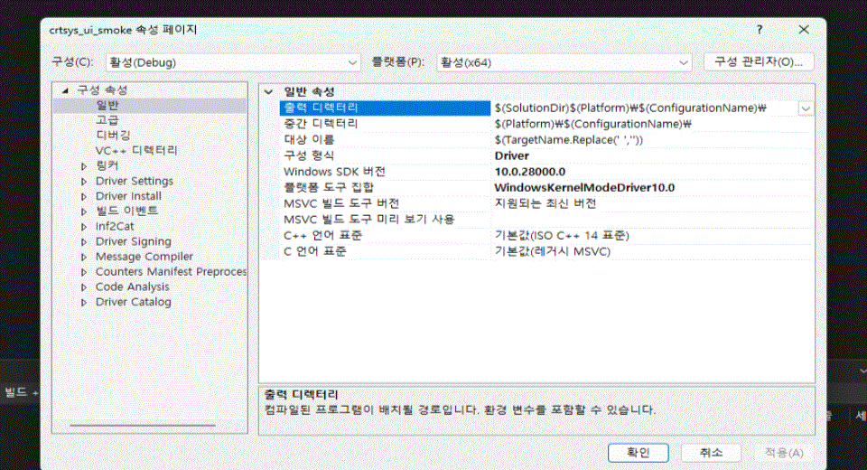
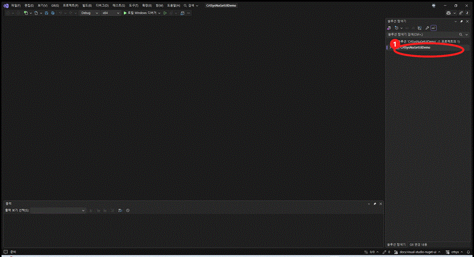

# MSBuild/NuGet 빠른 시작

[README로 돌아가기](./ko-kr.md)

이 경로는 `crtsys`를 native NuGet package로 소비하는 Visual Studio 또는
Build Tools WDK driver project용입니다. CMake/CPM GitHub 소비 경로와는
독립적인 사용 방식입니다.

## 요구 사항

- Visual Studio 또는 Build Tools 2017 이상
- 선택한 toolset에 맞는 Windows SDK와 WDK
- NuGet restore를 지원하는 MSBuild
- `crtsys` package가 있는 NuGet source 접근 권한

modern `PackageReference` project에서는 `nuget.exe`가 필수는 아닙니다.
MSBuild restore가 가능하면 `msbuild /restore`로 충분합니다. `nuget.exe`는
구형 `packages.config` 흐름이나 script가 `nuget restore`를 직접 호출하는
경우에만 별도로 설치하면 됩니다.

## Visual Studio

NuGet 설치 후 **프로젝트 속성 > Driver Settings > Driver Model**에서
드라이버 모델에 맞는 crtsys 진입점을 선택합니다. WDK의 **Type of driver**를
먼저 선택하면 해당 모델에 맞는 속성이 표시됩니다.



Visual Studio에서는 NuGet package UI를 사용하는 것이 가장 쉽습니다.



1. WDK driver solution을 엽니다.
2. driver project를 우클릭하고 **Manage NuGet Packages...**를 선택합니다.
3. `crtsys` package가 있는 package source를 선택합니다.
4. **crtsys**를 검색합니다.
5. driver project에 package를 설치합니다.
6. 사용하는 package/toolset 조합이 해당 architecture를 포함한다면 `x86`,
   `x64`, `ARM`, `ARM64`로 평소처럼 driver project를 빌드합니다.

Package Manager Console에서:

```powershell
Install-Package crtsys
```

그 다음 WDK driver project를 `x86`, `x64`, 또는 `ARM64`로 일반적인 방식대로 빌드합니다.

KMDF driver는 **Project Properties > Driver Settings > Driver Model**에서
먼저 WDK `Type of driver`를 `KMDF`로 설정해야 합니다. 그러면
**crtsys KMDF entry point** 속성에 `No NTL entry point`와 `NTL KMDF`가
표시되며, `NTL KMDF`를 선택하면 됩니다.

## Build Tools only

driver project에 `PackageReference`를 추가합니다.

```xml
<ItemGroup>
  <PackageReference Include="crtsys" Version="<version>" />
</ItemGroup>
```

MSBuild, SDK, WDK가 잡힌 Developer PowerShell 또는 Developer Command Prompt를
열고 restore와 build를 함께 실행합니다.

```powershell
msbuild .\my_driver.vcxproj /restore /p:Configuration=Debug /p:Platform=x64
```

x86 driver project는 MSBuild platform 이름으로 `Win32`를 사용합니다.

```powershell
msbuild .\my_driver.vcxproj /restore /p:Configuration=Debug /p:Platform=Win32
```

`ARM64`는 다음처럼 빌드합니다.

```powershell
msbuild .\my_driver.vcxproj /restore /p:Configuration=Release /p:Platform=ARM64
```

## Package가 가져오는 것

native package는 WDK consumer project에 필요한 MSBuild props/targets를
제공합니다. 여기에는 include path, forced include, runtime library, LDK
library, 선택한 driver model에 맞는 startup object가 포함됩니다.

| WDK project 형태 | crtsys 선택 | Source entry |
| --- | --- | --- |
| NTL entry wrapper를 쓰는 WDM | 기본값 또는 `<CrtSysUseNtlMain>true</CrtSysUseNtlMain>` | `ntl::main` |
| 일반 진입점을 쓰는 WDM | `<CrtSysUseNtlMain>false</CrtSysUseNtlMain>` | `DriverEntry` |
| 일반 KMDF | 기존 `<DriverType>KMDF</DriverType>` 설정의 기본값 | 일반 `DriverEntry`와 `WdfDriverCreate` |
| NTL KMDF | `<DriverType>KMDF</DriverType>` + `<CrtSysKmdfEntryPoint>NtlKmdf</CrtSysKmdfEntryPoint>` | `ntl::kmdf::main` |
| Export driver | WDK `ExportDriver` + crtsys 진입점 선택 없음 | WDK export-driver 진입 모델 |

NTL KMDF 진입점은 선택 사항입니다. 두 KMDF 방식 모두 PnP, power, queue,
request, object lifetime, dispatch 처리는 기존과 같이 WDF가 소유합니다.
`ExportDriver`는 일반 WDM 진입점이 아니라 WDK export-driver 모델이므로,
export driver에서는 NTL WDM, NTL KMDF, NTL Minifilter를 선택하면 안 됩니다.

driver는 여전히 일반 WDK driver입니다. Verifier, signing, target OS policy,
IRQL, paging, unload safety는 driver project가 책임집니다.

## CI smoke test 구조

이 저장소는 NuGet 소비가 문서로만 존재하지 않도록
[`test/nuget`](../test/nuget)에 consumer project를 둡니다.

- `crtsys_nuget_app_test.vcxproj`는 user-mode header/package 소비를 확인합니다.
- `crtsys_nuget_test.vcxproj`는 package로부터 WDK driver test source를
  선택한 MSVC toolset이 지원하는 package architecture의 `Debug`/`Release`에서
  빌드합니다.

CI job도 같은 모양으로 실행할 수 있습니다.

```powershell
msbuild .\test\nuget\crtsys_nuget_test.vcxproj /restore /p:Configuration=Release /p:Platform=x64
```

runtime driver load는 package consumption과 별도 문제입니다. 이 경로는
[CI driver load tests](./ci-driver-load-tests.md)에 정리되어 있습니다.
