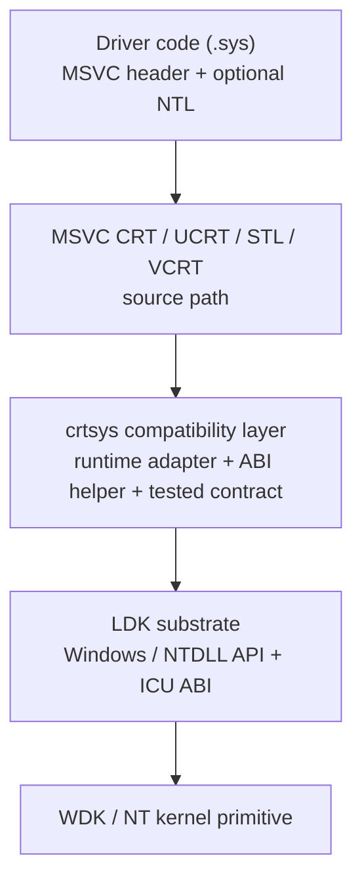

# crtsys

Windows 커널 드라이버(`.sys`)에서 익숙한 MSVC C++ 런타임과 STL 사용 경험을
제공하는 라이브러리입니다.

[](https://github.com/ntoskrnl7/crtsys/actions/workflows/cmake.yml)


[English documentation](../README.md)

`crtsys`는 MSVC CRT/STL/VCRT/UCRT source path를 Windows 커널 드라이버 안으로
가져옵니다. Driver code는 익숙한 MSVC C++ header와 STL type을 유지하고,
runtime dependency는 명시적인 driver-test coverage와 IRQL contract를 가진
kernel-mode substrate 위에 매핑됩니다.

목록에 있다는 것은 "driver test로 검증됨"이라는 뜻입니다. compile되거나
동작할 수 있는 모든 header/code path의 상한선을 뜻하지 않습니다.

## Quick Start

| 경로 | 사용할 때 | 시작점 |
| --- | --- | --- |
| NuGet / MSBuild | Visual Studio WDK driver project | `Install-Package crtsys` |
| CMake prebuilt | offline 또는 pinned CI dependency | `find_package(crtsys CONFIG REQUIRED)` |
| CMake source | driver와 함께 `crtsys`를 source build | `CPMAddPackage("gh:ntoskrnl7/crtsys@<version>")` |

Minimal CMake consumer:

```cmake
include(cmake/CPM.cmake)

set(CRTSYS_NTL_MAIN ON)
CPMAddPackage("gh:ntoskrnl7/crtsys@<version>")
include(${crtsys_SOURCE_DIR}/cmake/CrtSys.cmake)

crtsys_add_driver(my_driver src/main.cpp)
```

`CRTSYS_NTL_MAIN`을 켜면 C++ 진입점 wrapper를 사용할 수 있습니다.

```cpp
#include <ntl/driver>

ntl::status ntl::main(ntl::driver& driver,
                      const std::wstring& registry_path) {
  driver.on_unload([registry_path]() {
    // driver cleanup
  });

  return ntl::status::ok();
}
```

## Runtime Stack



## Capability Map

| 표면 | Driver-facing 결과 |
| --- | --- |
| C++ runtime | static init, EH/SEH, RTTI, ABI |
| CRT/UCRT | STL dependency, math, char conversion |
| STL | container, range, filesystem, format/print, regex, locale, chrono, threading, atomic, PMR, stream, random |
| Substrate | crtsys adapter + LDK Windows/NTDLL/ICU |
| Evidence | driver-run matrix + cppreference + IRQL contract |
| Packaging | NuGet/MSBuild + prebuilt bundle + CPM.cmake |

## Feature Highlights

| Feature | Status | Notes |
| --- | --- | --- |
| C++ exceptions | Driver-tested | `throw`, `try`/`catch`, function-try-block, `std::exception_ptr` |
| SEH handling | Driver-tested | `__try` / `__except` boundary 처리를 위한 C++ helper path |
| Static initialization | Driver-tested | non-local, dynamic, MSVC function-local static initialization |
| RTTI | Driver-tested | `typeid`, `dynamic_cast` |
| STL containers / algorithms | Driver-tested | container, algorithm, range, smart pointer, PMR, utility |
| `std::format` / `std::print` | Driver-tested | formatted string/output path |
| `std::regex` | Driver-tested | regular expression path |
| `std::filesystem` | Driver-tested | path, directory, copy, metadata, time, link-oriented path를 matrix에서 coverage |
| Concurrency | Driver-tested | thread, synchronization, async/future, atomic wait/notify |
| Locale / chrono / charconv | Driver-tested | locale facet, timezone/chrono path, integer/floating char conversion |
| NTL driver helpers | Driver-tested | `ntl::main`, driver/device helper, RPC, IRQL helper, stack expansion |
| `thread_local` | Not true TLS | compiler TLS는 true per-thread kernel TLS로 노출하지 않음 |

상세 matrix는 의도적으로 test-linked 형태입니다. Kernel driver test suite에서
실행한 기능을 기록하며, compile되거나 동작할 수 있는 모든 header/code path의
전체 목록을 의미하지 않습니다.

## Documentation

| 문서 | 볼 내용 |
| --- | --- |
| [아키텍처](./ko-kr-architecture.md) | Runtime stack, 계층별 책임, 소비 경로 |
| [설계 근거](./ko-kr-design-rationale.md) | IRQL, pool, stack, unload, 운영 경계 |
| [기능 지원 현황](./ko-kr-feature-coverage.md) | Driver-tested C++/CRT/STL matrix와 known gap |
| [NTL API](./ko-kr-ntl-api.md) | Driver helper API, entry wrapper, synchronization, SEH helper |
| [사용 예제](./ko-kr-usage-examples.md) | Driver-side NTL 예제 |
| [CI driver load tests](./ci-driver-load-tests.md) | optional self-hosted driver load/run workflow |

## Operational Boundaries

| 경계 | 정책 |
| --- | --- |
| Driver model | Driver는 정상적인 WDK driver로 남습니다. Verifier, HVCI, unload safety, target OS validation, paging rule은 여전히 중요합니다. |
| IRQL | Runtime-backed C++/CRT/STL path는 특정 API가 더 넓은 계약을 문서화하지 않는 한 `PASSIVE_LEVEL`입니다. |
| Stack | Kernel stack은 작습니다. exception-heavy 또는 STL-heavy path에는 `ntl::expand_stack` 사용을 고려하세요. |
| TLS | MSVC function-local static은 지원합니다. 일반 C++ `thread_local`은 true per-thread TLS가 아닙니다. |
| Toolchain | SDK/WDK 버전을 맞추는 것이 좋습니다. x86 kernel-mode target은 WDK 23H2 이하를 사용하세요. |

## 요구 사항

- Windows 7 이상
- Visual Studio 또는 Build Tools 2017 이상
- 선택한 Visual Studio toolset과 호환되는 Windows SDK 및 WDK
- CMake 3.14 이상
- Git

테스트된 toolchain에는 Visual Studio 2017, 2019, 2022와 `10.0.17763.0`,
`10.0.18362.0`, `10.0.22000.0`, `10.0.22621.0` SDK/WDK 계열이 포함됩니다.

Visual Studio 2017은 일부 CRT 소스/헤더 구성이 부족한 경로가 있어서,
해당 toolset에서는 일부 UCXXRT 호환 코드를 사용합니다.

## CMake 빠른 시작

드라이버 프로젝트에 `cmake/CPM.cmake`를 추가한 뒤 `crtsys`를 추가합니다.

```cmake
cmake_minimum_required(VERSION 3.14 FATAL_ERROR)

project(my_driver LANGUAGES C CXX)

include(cmake/CPM.cmake)

set(CRTSYS_NTL_MAIN ON)
CPMAddPackage("gh:ntoskrnl7/crtsys@<version>")
include(${crtsys_SOURCE_DIR}/cmake/CrtSys.cmake)

crtsys_add_driver(my_driver src/main.cpp)
```

`CRTSYS_NTL_MAIN`을 켜면 C++ 진입점 래퍼를 사용합니다. 이 경우 직접
`DriverEntry`를 작성하지 않고 `ntl::main`을 정의합니다.

```cpp
#include <iostream>
#include <string>
#include <ntl/driver>

ntl::status ntl::main(ntl::driver& driver,
                      const std::wstring& registry_path) {
  std::wcout << L"load: " << registry_path << L"\n";

  driver.on_unload([registry_path]() {
    std::wcout << L"unload: " << registry_path << L"\n";
  });

  return ntl::status::ok();
}
```

`CRTSYS_NTL_MAIN`을 끄면 일반 WDK 드라이버처럼 `DriverEntry`를 직접
작성하고 초기화를 수동으로 처리하면 됩니다.

Visual Studio generator로 빌드합니다.

```bat
cmake -S . -B build_x64 -A x64
cmake --build build_x64 --config Debug
```

`crtsys`는 기본적으로 진단용 `KdBreakPoint()` 호출을 유지합니다. 진단용
breakpoint 없이 빌드하려면 다음처럼 설정합니다.

```bat
cmake -S . -B build_x64 -A x64 -DCRTSYS_ENABLE_DIAGNOSTIC_BREAKPOINTS=OFF
```

## NuGet 패키지 상세

`crtsys`의 NuGet 배포는 Visual Studio/MSBuild 프로젝트용
`crtsys.<version>.nupkg`입니다.

## GitHub Release prebuilt 번들 상세

GitHub Release는 별도 오프라인 번들을 배포합니다.

- `crtsys-<version>-prebuilt.zip`: 헤더, 문서, CMake 헬퍼,
  x64/ARM64의 `Debug`/`Release` 사전 빌드 라이브러리.
- `crtsys-<version>-SHA256SUMS.txt`

prebuilt bundle은 source에서 `crtsys`를 fetch/build하지 않고, CMake
프로젝트에서 checked-in 또는 cached runtime package처럼 쓰기 위한
배포물입니다.

`prebuilt.zip`은 GitHub Release 전용 번들이며 NuGet 패키지가 아닙니다.

## CMake install

CMake 소비자는 로컬 CMake 패키지를 설치해서 사용할 수 있습니다.

```bat
cmake -S . -B build_x64 -A x64 -DCMAKE_INSTALL_PREFIX=%CD%\artifacts\install\crtsys
cmake --build build_x64 --config Release --target crtsys
cmake --install build_x64 --config Release
```

설치된 패키지는 소비자 프로젝트에서 다음처럼 찾습니다.

```cmake
find_package(crtsys CONFIG REQUIRED PATHS path/to/install-prefix)
crtsys_add_driver(my_driver src/main.cpp)
```

설치 트리는 GitHub Release prebuilt 번들과 같은 native library 레이아웃인
`lib/native/<arch>/<config>`를 사용합니다.

install 흐름은 다음 스모크 테스트로 확인할 수 있습니다.

```powershell
.\scripts\cmake\Test-CrtSysInstall.ps1 -Architecture x64 -Configuration Release
```

릴리스/게시 방법, release helper, Trusted Publishing 설정은 `nuget/README.md`에
모아서 정리해두었습니다. 자세한 앱/드라이버 동작 방식도 같은 문서에서 확인하세요.

## 이 저장소 빌드

저장소를 clone한 뒤, 현재 호스트 아키텍처 기준으로 테스트 앱과 드라이버를
빌드합니다.

```bat
git clone https://github.com/ntoskrnl7/crtsys
cd crtsys
test\build.bat
```

특정 대상을 직접 빌드하려면 다음처럼 실행합니다.

```bat
build.bat test\cmake\app x64 Debug
build.bat test\cmake\driver x64 Debug
build.bat test\cmake\app x64 Release
build.bat test\cmake\driver x64 Release
```

지원하는 모든 아키텍처와 구성 조합을 빌드하려면 다음 명령을 사용합니다.

```bat
build_all.bat test\cmake\app
build_all.bat test\cmake\driver
```

`build_all.bat`은 빌드를 순차 실행하고, 첫 실패의 exit code를 반환합니다.
두 번째 인자로 `Debug` 또는 `Release`를 넘기면 해당 구성만 빌드합니다.

일반적인 Debug 출력 경로는 다음과 같습니다.

```text
test\cmake\driver\build_x64\Debug\crtsys_test.sys
test\cmake\app\build_x64\Debug\crtsys_test_app.exe
```

## 테스트 실행

`crtsys_test.sys`는 커널 드라이버입니다. CI에서는 빌드 검증만 할 수 있고,
실제 로드와 실행은 Windows 드라이버 테스트 환경에서 수행해야 합니다.

CI 빌드 workflow와 선택적 self-hosted 드라이버 로드 테스트 경로는
[CI driver load tests](./ci-driver-load-tests.md)에 정리되어 있습니다.

```bat
sc create CrtSysTest binpath= "C:\path\to\crtsys_test.sys" displayname= "crtsys test" start= demand type= kernel
sc start CrtSysTest

C:\path\to\crtsys_test_app.exe

sc stop CrtSysTest
sc delete CrtSysTest
```

테스트 드라이버는 내부적으로 Google Test를 사용합니다. 결과는 DebugView,
WinDbg 또는 일반적인 커널 디버깅 환경에서 확인하세요.

## 저장소 구조

```text
cmake/             CrtSys.cmake를 포함한 CMake 헬퍼
include/ntl/       NTL C++ 헬퍼 헤더
include/.internal/ 내부 버전 및 toolchain 호환 헤더
src/               crtsys 런타임 및 CRT/STL 호환 코드
test/cmake/app/    CMake 사용자 모드 테스트 companion 앱
test/cmake/driver/ CMake 커널 모드 테스트 드라이버
test/nuget/        Visual Studio WDK NuGet 소비자 테스트 프로젝트
docs/              추가 문서
```

## 배경

`crtsys`는 UCXXRT와 KTL 같은 커널 C++ 런타임 프로젝트를 실험한 뒤 만들어진
프로젝트입니다. 목표는 CMake/WDK 흐름을 실용적으로 유지하면서 실제 드라이버
실험에 충분한 Microsoft CRT/STL 동작을 지원하는 것입니다.

프로젝트는 Microsoft CRT/STL 소스를 vendored library처럼 다루지 않으려는
방향으로 설계되었습니다. 대신 로컬에 설치된 Visual Studio/Build Tools의
구성과 작은 커널 모드 호환 코드를 함께 사용합니다. Microsoft가 제공하는
소스/헤더 구성이 부족한 오래된 toolset에서는 일부 호환 코드를 사용합니다.

아래 프로젝트의 구현도 필요한 곳에서 참고했습니다.

- [RetrievAL](https://github.com/SpoilerScriptsGroup/RetrievAL)
- [musl](https://github.com/bminor/musl)
- [zpp serializer](https://github.com/eyalz800/serializer)

## 로드맵

- driver-tested C++ 및 STL coverage를 넓힙니다. true `thread_local`
  storage는 별도 검토 항목입니다.
- Visual Studio 2017 호환성 간격을 줄이고 toolset별 호환 코드를 더
  작게 유지합니다.
- 적절한 테스트 환경이 준비되는 범위에서 실제 드라이버 로드/실행 CI
  coverage를 넓힙니다.
