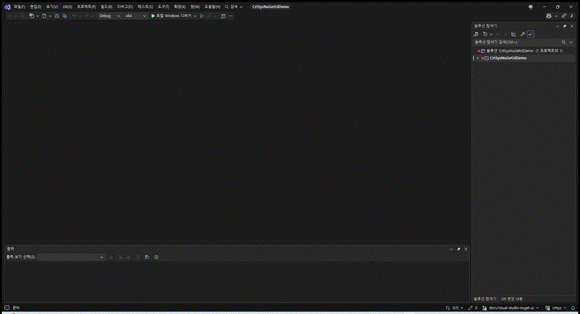

# MSBuild/NuGet Quick Start

[Back to README](../README.md)

Use this path for Visual Studio or Build Tools WDK driver projects that consume
`crtsys` as a native NuGet package. This is independent of the CMake/CPM GitHub
consumption path.

## Requirements

- Visual Studio or Build Tools 2017 or later
- Windows SDK and WDK for the selected toolset
- MSBuild with NuGet restore support
- Access to the NuGet source that contains `crtsys`

`nuget.exe` is optional for modern `PackageReference` projects. If MSBuild
restore is available, `msbuild /restore` is enough. Install `nuget.exe` only for
older `packages.config` flows or scripts that explicitly call `nuget restore`.

## Visual Studio

The easiest path in Visual Studio is the NuGet package UI:



1. Open the WDK driver solution.
2. Right-click the driver project and choose **Manage NuGet Packages...**.
3. Select the package source that contains `crtsys`.
4. Search for **crtsys**.
5. Install the package into the driver project.
6. Build the driver normally for `x86`, `x64`, `ARM`, or `ARM64` when using a
   package/toolset combination that carries that architecture.

If you prefer Package Manager Console:

```powershell
Install-Package crtsys
```

The package UI and Package Manager Console both add the same native NuGet
package reference to the project.

For a minifilter, open **Project Properties > Driver Settings > Driver Model**
and set **crtsys Driver Model** to **NTL Minifilter**. The package translates
that selection to `CrtSysIsMinifilter=true` and
`CrtSysUseNtlFltMain=true`; no manual XML property editing is required. If the
new row is not visible immediately, reload the project after NuGet restore.

For NTL KMDF, first set the WDK **Type of driver** property to **KMDF**, then
set **crtsys Driver Model** to **NTL KMDF** on the same page. The package then
sets `CrtSysUseNtlKmdfMain=true`.

The same dropdown also exposes **NTL WDM** and **Standard WDM**. `NTL WDM`
selects `ntl::main`; `Standard WDM` selects the project's ordinary
`DriverEntry`. Leaving **Use project driver model** selected preserves the
existing project properties.

## Build Tools Only

Add a `PackageReference` to the driver project:

```xml
<ItemGroup>
  <PackageReference Include="crtsys" Version="<version>" />
</ItemGroup>
```

Open a Developer PowerShell or Developer Command Prompt that has MSBuild, the
SDK, and the WDK on the environment, then build with restore:

```powershell
msbuild .\my_driver.vcxproj /restore /p:Configuration=Debug /p:Platform=x64
```

For x86 driver projects, use the MSBuild `Win32` platform name:

```powershell
msbuild .\my_driver.vcxproj /restore /p:Configuration=Debug /p:Platform=Win32
```

For `ARM64`:

```powershell
msbuild .\my_driver.vcxproj /restore /p:Configuration=Release /p:Platform=ARM64
```

For 32-bit `ARM` on v142/v143:

```powershell
msbuild .\my_driver.vcxproj /restore /p:Configuration=Release /p:Platform=ARM
```

## What The Package Imports

The native package supplies the MSBuild props/targets needed by a WDK consumer
project, including include paths, forced includes, runtime libraries, LDK
libraries, and the startup object for the selected driver model.

| WDK project shape | crtsys selection | Source entry |
| --- | --- | --- |
| WDM with the NTL entry wrapper | default, or `<CrtSysUseNtlMain>true</CrtSysUseNtlMain>` | `ntl::main` |
| WDM with a standard entry | `<CrtSysUseNtlMain>false</CrtSysUseNtlMain>` | `DriverEntry` |
| Standard KMDF | existing `<DriverType>KMDF</DriverType>`; default | standard `DriverEntry` and `WdfDriverCreate` |
| NTL KMDF | `<DriverType>KMDF</DriverType>` and `<CrtSysUseNtlKmdfMain>true</CrtSysUseNtlKmdfMain>` | `ntl::kmdf::main` |

The NTL KMDF entry is optional. In both KMDF modes WDF retains its normal PnP,
power, queue, request, object-lifetime, and dispatch ownership.

The driver remains a normal WDK driver. Verifier, signing, target OS policy,
IRQL, paging, and unload safety are still owned by the driver project.

## CI Smoke Test Shape

The repository keeps NuGet consumer projects under [`test/nuget`](../test/nuget)
so package consumption is build-tested instead of only documented:

- `crtsys_nuget_app_test.vcxproj` verifies user-mode header/package
  consumption.
- `crtsys_nuget_test.vcxproj` builds the WDK driver test sources from the
  package for every packaged architecture that the selected MSVC toolset
  supports.

A CI job can use the same shape:

```powershell
msbuild .\test\nuget\crtsys_nuget_test.vcxproj /restore /p:Configuration=Release /p:Platform=x64
```

Runtime driver loading is a separate concern from package consumption. The
repository documents that path in [CI Driver Load Tests](./ci-driver-load-tests.md).
