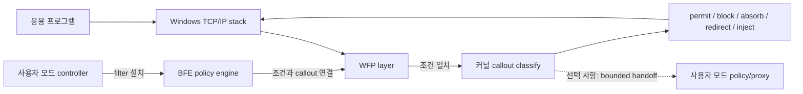

# WFP가 처음인 드라이버 개발자를 위한 NTL 가이드

[NTL 문서로 돌아가기](./README.ko-KR.md) · [WFP 상세 API](./wfp.ko-KR.md) ·
[WFP 예제 목록](../../examples/wfp/README.ko-KR.md) ·
[English](./wfp-guide.md)

이 문서는 WDM·KMDF·minifilter 같은 Windows 드라이버 개발 경험은 있지만
WFP와 NDIS는 처음인 개발자를 위한 전체 지도입니다. WFP 구조를 먼저 이해한
뒤 NTL에서 실제로 무엇을 작성해야 하는지 연결합니다.

## 30초 요약

WFP는 TCP/IP 스택의 여러 지점에 이미 준비된 **layer**를 제공합니다.

1. 사용자 모드 controller가 BFE(Base Filtering Engine)에 **filter**를 설치합니다.
2. filter 조건과 일치하는 트래픽만 커널 **callout**으로 전달됩니다.
3. callout은 typed metadata나 packet/stream view를 보고 허용·차단·보류·변조합니다.
4. HTTP·TLS·QUIC 같은 application protocol이 필요하면 공통 `ntl::net` 정책을
   user 또는 kernel runtime에 연결합니다.

controller가 매 패킷을 직접 검사하는 구조가 기본은 아닙니다. controller는
주로 “어떤 트래픽을 어느 callout으로 보낼지”라는 정책 graph를 설치하고,
실제 classify callback은 커널에서 호출됩니다. 사용자 모드 판단이 필요한
예제만 bounded queue나 redirect proxy를 통해 선택된 데이터를 app으로 보냅니다.

## 이 문서는 어느 실행 모델을 기준으로 하는가

이 문서는 **공통 WFP 구조를 먼저 설명한 뒤, 커널 중심과 사용자 모드 중심의 두
실행 모델을 모두 다룹니다.** 다만 WFP filter에 연결되는 callout 자체는 Windows
커널 구성 요소이므로 layer, filter, callout, classify 같은 기초 설명은 두 방식
모두에서 커널 관점으로 시작합니다.

두 방식의 차이는 “WFP를 쓰느냐”가 아니라 **선택된 트래픽의 실제 검사·정책
실행을 어디에서 하느냐**입니다.

| 실행 모델 | 커널이 담당하는 일 | 사용자 모드가 담당하는 일 | 먼저 볼 예제 |
| --- | --- | --- | --- |
| 커널 중심 | WFP classify, packet/stream 처리, 프로토콜 검사와 판정·변조 | filter 설치, 설정·인증서 공급, 상태 조회 | `kernel/ale-connect-block`, `kernel/browser-https-inspection` |
| 사용자 모드 중심 | built-in filter action만 쓰거나, 최소 callout driver가 선택·redirect·bounded handoff 담당 | proxy, TLS/QUIC 종료, HTTP 검사와 판정·변조 | `user/connect-redirect`, `user/browser-https-inspection` |
| hybrid/offload | 빠른 판정, fail-closed, queue와 timeout 관리 | 무거운 분석 또는 제품 정책 | 제품 요구에 맞게 두 runtime 조합 |

```text
공통 policy plane
  controller -> BFE filter -> typed callout key

커널 중심 data plane
  WFP callout -> ntl::net kernel runtime -> inspect/transform -> reinject

사용자 모드 중심 data plane
  WFP callout -> redirect 또는 bounded handoff
              -> ntl::net user runtime -> inspect/transform -> forward
```

따라서 이 문서에서 `callout_driver`를 설명한다고 해서 커널 중심 제품만을
가정하는 것은 아닙니다. 단순 permit/block filter는 사용자 모드에서 BFE 정책만
설치할 수도 있습니다. NTL의 사용자 모드 검사·프록시 예제처럼 redirect나 payload
handoff가 필요할 때는 최소 callout driver가 그 경계를 담당합니다. 반대로
controller는 커널 중심 제품에서도 BFE filter를 설치하고 정책 수명을 관리합니다.



## WFP와 NDIS의 차이

둘 다 네트워크 드라이버 기술이지만 관찰 위치와 책임이 다릅니다.

| 질문 | WFP | NDIS filter/miniport |
| --- | --- | --- |
| 주된 관점 | 연결, flow, transport, stream, packet에 대한 정책 | NIC와 protocol stack 사이의 L2 frame/NBL 경로 |
| 대표 정보 | 프로세스, AppContainer, 주소, 포트, 방향, flow | Ethernet header, VLAN, offload, RSS, NIC send/receive |
| 대표 작업 | 방화벽, 연결 차단, redirect, DPI, stream/datagram 변조 | L2 frame 처리, 가상 NIC, capture, NIC/offload 제어 |
| Windows가 제공하는 정책 엔진 | BFE와 WFP filter arbitration | 없음. NDIS callback에서 직접 경로를 관리 |
| 처음 선택할 기준 | “어느 앱의 어느 연결/패킷을 허용할까?” | “NIC를 오가는 frame/NBL 자체를 다뤄야 할까?” |

프로세스별 차단, TCP/UDP redirect, flow 추적, HTTP 검사라면 WFP부터 선택하는
것이 보통 맞습니다. Ethernet frame, ARP, VLAN, 가상 어댑터, NIC offload가
핵심이면 NDIS가 맞습니다. HTTP/3가 UDP를 쓴다고 해서 곧바로 NDIS가 필요한
것은 아닙니다. WFP의 UDP/IP layer와 MsQuic을 조합할 수 있습니다.

## WFP 객체를 기존 드라이버 개념에 대응시키기

| WFP 개념 | 드라이버 개발자 관점의 의미 |
| --- | --- |
| layer | OS가 정한 callback 지점과 그 지점에서 제공되는 typed 입력 schema |
| filter | layer에서 어떤 트래픽을 선택할지 정하는 사용자 모드 규칙 |
| callout | 선택된 트래픽을 처리하는 커널 callback 묶음 |
| classify callback | IRP dispatch와 비슷한 실제 판단 진입점. 단 WFP action 규약을 따름 |
| provider | 한 제품이 소유하는 WFP 객체들의 관리 단위 |
| sublayer | 여러 provider/filter 결과의 우선순위와 arbitration 경계 |
| flow context | 연결/flow에 한 번 붙이고 이후 callback에서 재사용하는 typed 상태 |
| injection handle | clone 또는 새 packet/stream을 TCP/IP stack에 비동기로 돌려보내는 주체 |
| policy session | BFE에 설치한 provider/sublayer/callout/filter의 수명과 transaction |

중요한 점은 **layer마다 사용할 수 있는 field와 action이 다르다**는 것입니다.
예를 들어 ALE 연결 layer에는 프로세스와 포트가 있지만 application payload는
없습니다. 반대로 stream layer에서는 TCP byte stream을 볼 수 있지만 이를
“TCP message 하나”라고 가정할 수 없습니다.

NTL은 `layer + condition + callout kind + callback result`를 타입으로 묶습니다.
다른 layer의 field를 읽거나, 해당 layer에서 존재하지 않는 port 조건을 추가하거나,
terminating callout에서 `continue`를 반환하는 코드는 컴파일되지 않습니다.

## Filter와 callout은 서로 다른 곳에 있다

가장 먼저 이 분리를 기억하면 WFP가 쉬워집니다.

```text
사용자 모드                         커널 모드
-------------------------------    ---------------------------------
policy_session                       callout_driver
  provider                             add_terminating(...)
  sublayer                             classify_event<Layer>
  callout metadata       GUID/key      terminating_decision
  filter conditions  -------------->   실제 permit/block callback
```

양쪽은 동일한 typed key를 공유합니다. controller의 filter가 특정 callout key를
가리키고, driver가 그 key로 callback을 등록해야 실제 호출이 연결됩니다.

### 공유 계약

```cpp
using connect_layer = ntl::wfp::layers::ale_auth_connect_v4;

inline constexpr ntl::wfp::terminating_callout_key<connect_layer>
    connect_callout{project_owned_guid};

inline constexpr ntl::wfp::filter_key<connect_layer>
    connect_filter{another_project_owned_guid};
```

raw `GUID`를 아무 API에나 넘기지 않는 이유는 layer나 객체 종류가 다른 key를
실수로 연결하지 못하게 하기 위해서입니다.

### controller: 어떤 트래픽을 선택할지 설치

```cpp
auto policy = ntl::wfp::policy_session::ephemeral(L"my controller");

policy.install([&](ntl::wfp::policy_transaction& tx) {
  const auto provider = tx.add_provider(
      {provider_key, L"My provider", L"My product WFP policy"});
  const auto sublayer = tx.add_sublayer(
      provider,
      {sublayer_key, L"My sublayer", L"My policy boundary", 0x7100});
  const auto callout = tx.add_callout<connect_layer>(
      provider,
      {connect_callout, L"My callout", L"Typed terminating callout"});

  ntl::wfp::filter_builder<connect_layer> filter(
      connect_filter,
      L"Block selected TCP destination",
      ntl::wfp::callout_unavailable::block);

  filter.protocol_equal(IPPROTO_TCP)
        .remote_address_equal(
            ntl::wfp::ipv4_address::from_octets(127, 0, 0, 1))
        .remote_port_equal(443);

  tx.add_filter(sublayer, callout, filter);
});
```

`ephemeral` session은 controller 수명과 정책 수명을 묶습니다. 제품이 죽어도
정책이 남아야 한다면 persistent revision, reconcile, migration, rollback 및
boot-time fail-closed 정책을 명시적으로 선택합니다.

### driver: 선택된 트래픽을 판정

```cpp
ntl::wfp::callout_driver<> callouts(driver);

const ntl::status status = callouts.add_terminating(
    connect_callout,
    [](const ntl::wfp::classify_event<connect_layer>& event) noexcept {
      const auto port =
          event.value(connect_layer::field::remote_port).uint16();
      return port && *port == 443
                 ? ntl::wfp::terminating_decision::block
                 : ntl::wfp::terminating_decision::permit;
    });
```

실제 예제는 controller filter가 이미 port를 제한하므로 callback이 더 간단해질
수 있습니다. 위 코드는 typed field 읽기를 함께 보여주기 위한 형태입니다.

## `inspection`, `terminating`, `arbitrating`의 의미

여기서 `terminating`은 연결을 종료한다는 뜻이 아닙니다. WFP filter evaluation에서
최종 permit/block 판정을 내리는 callout이라는 뜻입니다.

| NTL 등록 함수 | filter action | callback이 반환할 수 있는 값 |
| --- | --- | --- |
| `callouts.add_inspection(...)` | non-terminating inspection | 반환값 없음(`void`), NTL이 자동으로 계속 진행 |
| `callouts.add_terminating(...)` | terminating | `permit`, `block`, `block_and_absorb` |
| `callouts.add_arbitrating(...)` | WFP UNKNOWN/arbitrating | `continue_classification`, `permit`, `block`, `block_and_absorb` |

세 함수의 차이는 callback 이름이 아니라 controller가 설치한 WFP filter action과
callback의 반환 계약에 있습니다. typed callout key도 이 종류를 포함하므로 서로
다른 종류를 실수로 연결할 수 없습니다.

관찰만 하는 `add_inspection()` callback은 다음처럼 작성합니다.

```cpp
using flow_layer = ntl::wfp::layers::ale_flow_established_v4;
inline constexpr ntl::wfp::inspection_callout_key<flow_layer>
    flow_callout{project_flow_callout_guid};

const ntl::status status = callouts.add_inspection(
    flow_callout,
    [](const ntl::wfp::classify_event<flow_layer>& event) noexcept {
      record_flow(event);     // 반환값이 없다.
    });                       // callback 뒤에는 NTL이 FWP_ACTION_CONTINUE 적용
```

`add_inspection()`은 `noexcept void` callback만 받습니다. 관찰 결과로 permit이나
block을 선택할 수 없으므로 사용자가 항상 같은 `continue_classification` 값을
직접 반환하게 만들 이유가 없습니다. callback 본문은 관찰 작업만 수행하고 값을
반환하지 않습니다. 반환값이 있는 callback은 overload가 선택되지 않아
컴파일되지 않습니다.

`add_terminating()`은 해당 callout에서 최종 허용·차단을 확정할 때 사용합니다.
따라서 `continue_classification`은 선택지에 없습니다. 반면
`add_arbitrating()`은 WFP `FWP_ACTION_CALLOUT_UNKNOWN` filter와 연결되어 현재
callout이 판정하거나 다음 filter에 판단을 넘길 수 있을 때만 사용합니다. 일반적인
허용·차단 정책은 의도가 더 좁고 명확한 `add_terminating()`을 우선 선택하고,
실제로 arbitration이 필요한 정책에만 `add_arbitrating()`을 사용합니다.

`block_and_absorb`는 원본을 차단하면서 이후 자신이 clone/reinject한 결과만 흐르게
할 때 주로 사용합니다. 단순 연결 차단에는 보통 `block`이면 충분합니다.

`callout_unavailable`은 driver callout이 등록되지 않았을 때 filter가 어떻게
동작할지를 정합니다. 보안 enforcement filter는 대개 fail-closed인 `block`이
맞습니다. 하지만 loopback 전체처럼 넓게 관찰하는 reverse hook은 무조건 block하면
로컬 네트워크 전체를 끊을 수 있습니다. 이런 예외는 예제에서 조립하지 않고
`transparent_udp_proxy_policy/service` 같은 semantic facade가 내부 규칙으로
고정합니다.

## 목적에 맞는 layer 고르기

| 하고 싶은 일 | 먼저 볼 layer/API | payload 상태 |
| --- | --- | --- |
| 외부 TCP 연결 허용·차단 | `ale_auth_connect_v4/v6` | 없음 |
| inbound accept 허용·차단 | `ale_auth_recv_accept_v4/v6` | 없음 |
| 연결 목적지를 로컬 proxy로 변경 | `ale_connect_redirect_v4/v6` | 없음 |
| bind 주소/포트 변경 | `ale_bind_redirect_v4/v6` | 없음 |
| flow별 상태 생성 | `ale_flow_established_v4/v6` + `flow_target` | 없음 |
| TCP 연속 byte 검사·편집 | `stream_v4/v6` | TCP stream fragment |
| UDP datagram 검사·재주입 | `datagram_data_v4/v6` | 하나의 datagram, 여러 MDL일 수 있음 |
| transport/IP packet 변환 | transport/IP packet layer + typed injector | NBL/MDL packet |
| HTTP/TLS/QUIC semantic 검사 | redirect/transport + `ntl::net` runtime | 복호화와 framing 후 message |

layer는 “낮을수록 더 강력하다”는 순서가 아닙니다. 필요한 metadata와 원하는
action이 동시에 존재하는 가장 높은 layer를 고르는 것이 보통 안전하고 간단합니다.

## packet, stream, message는 서로 다르다

```text
Ethernet frame
  └─ IP packet
      ├─ UDP datagram ── application message인 경우가 많음
      └─ TCP segment ── TCP byte stream의 일부일 뿐
                         └─ HTTP/1 message, HTTP/2 frame, TLS record 등으로 재조립
```

- NBL 하나가 연속 메모리라는 보장은 없습니다. MDL chain과 fragment를 고려합니다.
- TCP callback 한 번이 application message 하나라는 보장은 없습니다.
- UDP datagram 경계는 보존되지만 application protocol이 datagram 여러 개를 묶을
  수도 있습니다.
- WFP ALE metadata callback에는 packet body가 아예 없습니다.

NTL의 `scatter_view`는 조각난 packet을 불필요하게 flatten하지 않고 읽습니다.
callback 이후에도 데이터가 필요할 때만 owning buffer나 retained/cloned packet으로
명시적으로 수명을 연장합니다. TCP application message에는 framer/codec을 지정하고,
HTTP에는 공통 HTTP/1·HTTP/2·HTTP/3 adapter를 사용합니다.

## TLS와 QUIC에서 평문이 바로 보이지 않는 이유

WFP는 TLS 복호화 API가 아닙니다.

```text
HTTP/1.1 또는 HTTP/2:
  TCP bytes -> TLS termination -> HTTP framing -> shared inspection policy

HTTP/3:
  UDP datagrams -> QUIC/TLS 1.3 endpoint -> HTTP/3/QPACK -> shared policy
```

따라서 HTTPS 내용을 검사하려면 연결을 선택·redirect한 뒤 TLS를 실제로 종료해야
합니다. user 예제는 Schannel/MsQuic user runtime을, kernel 예제는 WSK,
kernel Schannel 및 kernel MsQuic provider 경계를 사용합니다. 어느 쪽이든
복호화된 HTTP message에는 같은 `ntl::net::http::inspection_policy`와
`transform_pipeline`을 적용합니다.

```cpp
ntl::net::http::transform_pipeline http(limits);

http.requests()
    .when([](const auto& request) noexcept {
      return request.method == "POST" &&
             request.headers.first("x-policy") == "block";
    })
    .decide([](const auto&) noexcept {
      return ntl::net::inspection::verdict::block;
    });

http.responses().html().transform(
    [](const auto&, auto& response) {
      // bounded decoder가 만든 완성된 semantic body
      return ntl::net::http::rewrite_result::replace_body(
          std::move(response.body),
          ntl::net::http::transformed_body_coding::preserve);
    });
```

정책은 method, scheme, authority, path, query, header, body, process,
application path, original destination, SNI, ALPN 및 사용자 predicate를 함께 볼 수
있습니다. HTTP/1.1·HTTP/2·HTTP/3 transport가 다른 wire framing을 처리한 뒤 같은
semantic message와 정책을 사용합니다.

TLS/QUIC 종료가 있어도 다음은 별도 제품 정책 또는 기술 경계입니다.

- 신뢰할 수 있는 inspection CA와 private key 관리
- certificate pinning과 mTLS client identity 선택
- ECH로 숨겨진 inner ClientHello/SNI
- 임의 브라우저의 private CA/QUIC trust 정책
- 외부 네트워크가 UDP/443 또는 HTTP/3를 차단하는 경우

## user 처리와 kernel 처리 중 무엇을 고를까

| 선택 | 장점 | 비용 |
| --- | --- | --- |
| user policy/proxy | TLS/QUIC 라이브러리, 인증서 저장소, 로그, 업데이트가 편함 | context switch, IPC/redirect, service 장애 정책 필요 |
| kernel direct | data plane을 커널 안에 유지하고 user service 없이 직접 판정 가능 | IRQL, stack, nonpaged memory, provider ABI, unload/drain 책임이 큼 |
| hybrid/offload | kernel이 fast path와 fail-closed를 소유하고 무거운 분석만 user에 위임 | timeout, queue quota, cancellation, service death 계약 필요 |

NTL의 user/kernel 예제 차이는 정책 기능이 아니라 **실행 위치**입니다. 가능한
경우 동일한 shared policy를 사용하며, kernel runtime은 PASSIVE 전환, 확장 stack,
bounded workspace 및 callback drain을 내부에서 처리합니다.

## NTL이 대신 책임지는 부분과 사용자가 정하는 부분

### NTL이 막거나 소유하는 것

- layer에 없는 field/condition 조합의 컴파일 차단
- callout kind와 callback 반환 계약 불일치 차단
- `FWPS_RIGHT_ACTION_WRITE`, absorb 및 clear-action-right 적용
- flow context, clone, injection completion의 소유권
- close 중 신규 작업 거절, 진행 중 operation/callback drain
- 고 IRQL 최종 해제의 PASSIVE cleanup 전달
- bounded queue/workspace와 exhaustion 시 fail-closed
- HTTP/1·2·3 framing, HPACK/QPACK, content coding의 공통 정책 연결
- transparent UDP proxy의 self-injection/loop 방지와 IPv4/IPv6 tuple 복원

### 제품 코드가 반드시 정하는 것

- 어떤 application/address/port/identity를 filter할지
- 장애 시 fail-open인지 fail-closed인지
- ephemeral 또는 persistent/boot-time 정책 수명
- 최대 header/body/frame/flow/queue 크기
- 인증서 발급·신뢰·감사 정책
- 수집할 데이터와 개인정보 최소화 정책
- 배포 signing, HVCI, OS/toolset 지원 범위

## 수명과 unload를 보는 방법

NTL의 기본 공개 객체는 owning facade입니다. facade의 `close()`는 멱등적이며
신규 작업을 막고 child operation과 callback을 drain한 뒤 native state를
정리합니다. 사용자가 provider/credential/transport 멤버 선언 순서를 기억하거나
detached work item과 수동 rundown을 조립하는 방식이 기본 사용법이 아닙니다.

```cpp
driver.on_unload([callouts] mutable {
  const ntl::status status = callouts.close();
  NT_ASSERT(status.is_ok());
});
```

예제가 `close()`를 명시하는 것은 종료 결과와 최종 telemetry를 검증하기
위해서입니다. 정상 RAII 파괴도 같은 shared state를 정리합니다. 저장 가능한
비소유 참조가 꼭 필요하면 이름에 `borrowed_*`, `*_view`, `*_ref`가 나타납니다.

callback 안에서는 다음 원칙을 지킵니다.

- `noexcept`를 사용하고, inspection은 `void`, enforcement는 정확한 decision/result
  type을 반환합니다.
- callback-scoped view를 저장하지 않습니다.
- 큰 parser, 압축, TLS 작업을 임의의 classify stack에서 동기 중첩하지 않습니다.
- NTL semantic runtime/facade가 제공하는 executor와 workspace 경계를 사용합니다.

## 예제 선택 지도

처음에는 아래 순서로 보는 것이 좋습니다.

1. [`kernel/ale-connect-block`](../../examples/wfp/kernel/ale-connect-block/README.ko-KR.md)
   — filter, callout, typed decision의 최소 구조
2. [`kernel/flow-monitor`](../../examples/wfp/kernel/flow-monitor/README.ko-KR.md)
   — flow context와 stream 관찰
3. [`kernel/datagram-proxy`](../../examples/wfp/kernel/datagram-proxy/README.ko-KR.md)
   — UDP clone/reinject 대신 semantic owning facade 사용
4. [`user/connect-redirect`](../../examples/wfp/user/connect-redirect/README.ko-KR.md)
   — TCP를 사용자 모드 proxy로 안전하게 넘기는 방법
5. [`user/tls-inspection-proxy`](../../examples/wfp/user/tls-inspection-proxy/README.ko-KR.md)
   — TLS 종료 후 HTTP/1.1·HTTP/2 공통 정책
6. [`user/browser-https-inspection`](../../examples/wfp/user/browser-https-inspection/README.ko-KR.md)
   — HTTP/1.1·HTTP/2·HTTP/3, 압축, WebSocket, gRPC, WebTransport 종합
7. [`kernel/browser-https-inspection`](../../examples/wfp/kernel/browser-https-inspection/README.ko-KR.md)
   — 같은 기능을 kernel data plane에서 수행

`test/wfp/runtime/fixtures`의 traffic generator와 assertion은 예제 본문에서
분리되어 있습니다. 제품 예제에는 정책과 data plane만 있고, 임의 트래픽 생성과
PASS 판정은 test fixture에 있습니다.

## 빌드와 검증

### CMake

```cmake
crtsys_add_driver(my_callout WFP NTL driver/main.cpp)
```

kernel content codec이 필요하면 `KERNEL_CONTENT_CODECS`, kernel MsQuic이
필요하면 `KERNEL_MSQUIC`를 추가합니다.

### Visual Studio/NuGet

WDM driver 속성 페이지에서 **NTL WFP**를 선택하거나 다음 속성을 사용합니다.

```xml
<CrtSysWdmEntryPoint>NtlWfp</CrtSysWdmEntryPoint>
```

이 설정은 WFP 진입점과 `fwpkclnt.lib` 연결을 구성합니다. 빌드는 driver나
MsQuic provider를 HOST에 설치하거나 시작하지 않습니다.

### 검증 순서

```text
compile contracts
  -> x86/x64/ARM/ARM64 및 Debug/Release build
  -> disposable VM 설치/기능 시험
  -> 반복 stop/start와 unload
  -> Driver Verifier
  -> crash event/dump 및 Verifier 설정 불변 확인
```

WFP VM runner는 VM을 자동 재부팅하거나 Verifier 대상을 바꾸지 않습니다.
서명 검증 비활성화 boot와 Verifier 설정은 operator가 준비하고, runner는 전후
상태가 같은지 검증합니다. 현재 검증 범위는
[`test/wfp/WDK-SAMPLE-COVERAGE.ko-KR.md`](../../test/wfp/WDK-SAMPLE-COVERAGE.ko-KR.md)에
기록됩니다.

## 실무 점검표

- [ ] 필요한 metadata/action이 존재하는 가장 높은 WFP layer를 선택했는가?
- [ ] controller filter와 driver callout이 동일한 typed key/layer/kind를 쓰는가?
- [ ] 비대상 패킷과 self-injected 패킷의 동작이 명확한가?
- [ ] 대상 처리 실패, queue/workspace 고갈의 fail-open/closed 정책이 명확한가?
- [ ] TCP fragment를 application message로 가정하지 않았는가?
- [ ] TLS/QUIC 평문 검사가 실제 termination 이후에 수행되는가?
- [ ] body/frame/flow/queue 크기와 압축 확장 비율에 상한이 있는가?
- [ ] callback-scoped view를 비동기 작업에 저장하지 않았는가?
- [ ] close가 신규 작업 차단과 callback/injection drain을 포함하는가?
- [ ] IPv4와 IPv6를 모두 빌드뿐 아니라 runtime에서 검증했는가?
- [ ] Driver Verifier에서 반복 load/run/unload와 장애 경로를 시험했는가?
- [ ] VPN, 방화벽, WebFilter 같은 다른 WFP provider와의 우선순위를 시험했는가?

## 한 문장으로 다시 정리

WFP 개발은 “packet callback을 하나 등록하는 일”이 아니라 **적절한 layer에서
filter가 트래픽을 선택하고, typed callout이 관찰하거나 허용된 decision을
반환하며, 필요할 때만 bounded transport/protocol runtime으로 내용을 해석하는
정책 pipeline을 만드는 일**입니다. NTL은 그 조합과 수명을 타입과 owning
facade로 고정하고, 제품 코드는 선택 조건과 실제 보안 정책에 집중하게 합니다.
