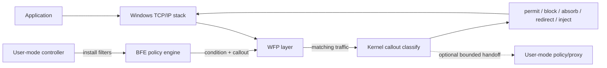

# NTL WFP guide for driver developers

[Back to NTL documentation](./README.md) · [WFP API reference](./wfp.md) ·
[WFP samples](../../examples/wfp/README.md) ·
[한국어](./wfp-guide.ko-KR.md)

This guide is for Windows driver developers who know WDM, KMDF, or
minifilters but are new to the Windows Filtering Platform (WFP). It first
builds a mental model of WFP and then maps that model to the NTL APIs and
samples.

## WFP in 30 seconds

WFP exposes predefined **layers** at different points in the Windows TCP/IP
stack.

1. A user-mode controller installs **filters** in the Base Filtering Engine
   (BFE).
2. Only traffic matching those filters reaches a kernel **callout**.
3. The callout observes typed metadata or packet/stream views and may permit,
   block, defer, redirect, or transform the traffic as allowed by that layer.
4. When HTTP, TLS, or QUIC semantics are required, the shared `ntl::net`
   policy is attached to either a user-mode or kernel runtime.

A controller does not normally inspect every packet itself. It installs the
policy graph that selects traffic and connects it to callouts. WFP invokes
classify callbacks in the kernel. Only designs that require user-mode policy
send selected traffic through a bounded handoff or redirected proxy.

## Which execution model does this guide cover?

This guide covers both **kernel-centered** and **user-mode-centered** WFP
designs. The common explanation begins in the kernel because a custom WFP
callout is a kernel component in both designs. The difference is where the
selected traffic is actually inspected and transformed.

| Model | Kernel responsibility | User-mode responsibility | Start with |
| --- | --- | --- | --- |
| Kernel-centered | WFP classification, packet/stream handling, protocol inspection, verdicts, and transforms | Filter installation, configuration, certificate provisioning, and status | `kernel/ale-connect-block`, `kernel/browser-https-inspection` |
| User-mode-centered | Built-in filter actions, or a minimal callout for selection, redirect, and bounded handoff | Proxying, TLS/QUIC termination, HTTP inspection, verdicts, and transforms | `user/connect-redirect`, `user/browser-https-inspection` |
| Hybrid/offload | Fast-path decisions, fail-closed behavior, queue and timeout ownership | Expensive analysis or product policy | Combine the two runtimes to match the product boundary |

```text
common policy plane
  controller -> BFE filter -> typed callout key

kernel-centered data plane
  WFP callout -> ntl::net kernel runtime -> inspect/transform -> reinject

user-mode-centered data plane
  WFP callout -> redirect or bounded handoff
              -> ntl::net user runtime -> inspect/transform -> forward
```

Simple permit/block rules can use built-in BFE actions without a custom
driver. The NTL user-mode inspection and proxy samples use a minimal callout
when they need redirect or payload handoff. Conversely, a kernel-centered
product still uses a controller to install filters and manage policy lifetime.



## WFP versus NDIS

Both are Windows network-driver technologies, but they operate at different
boundaries.

| Question | WFP | NDIS filter/miniport |
| --- | --- | --- |
| Primary view | Policy over connections, flows, transports, streams, and packets | L2 frame/NBL path between a NIC and protocol stack |
| Typical metadata | Process, AppContainer, address, port, direction, flow | Ethernet header, VLAN, RSS, offload, NIC send/receive |
| Typical work | Firewalling, connection blocking, redirect, DPI, stream/datagram transforms | L2 frame processing, virtual NICs, capture, and NIC/offload control |
| Policy engine | BFE and WFP filter arbitration | None; the NDIS driver owns the path directly |
| First design question | “Which application's traffic should this policy allow?” | “Must I control the actual frame/NBL path at the adapter boundary?” |

Start with WFP for per-process rules, TCP/UDP redirect, flow tracking, and HTTP
inspection. Start with NDIS when Ethernet frames, ARP, VLAN, virtual adapters,
or NIC offload are the core requirement. HTTP/3 using UDP does not by itself
require NDIS; WFP UDP/IP layers can be combined with MsQuic.

## Mapping WFP objects to familiar driver concepts

| WFP concept | Driver-developer interpretation |
| --- | --- |
| layer | An OS-defined callback point and its typed input schema |
| filter | A user-mode rule selecting traffic at a layer |
| callout | The kernel callback set that handles selected traffic |
| classify callback | The decision entry point, similar to dispatch but governed by WFP action rules |
| provider | The ownership boundary for one product's WFP objects |
| sublayer | A priority and arbitration boundary among filters/providers |
| flow context | Typed state attached once and reused by later flow callbacks |
| injection handle | The owner that asynchronously returns cloned or fresh data to the TCP/IP stack |
| policy session | The lifetime and transaction boundary for BFE objects |

The important rule is that **each layer exposes different fields and legal
actions**. An ALE connection layer has process and port metadata but no
application payload. A stream layer exposes TCP bytes, but those bytes are not
guaranteed to be one application message.

NTL binds `layer + condition + callout kind + callback result` in the type
system. Code does not compile if it reads a field from another layer, adds a
port condition to a layer that has no port field, or returns `continue` from a
terminating callout.

## Filters and callouts live on different sides

```text
user mode                            kernel mode
--------------------------------    --------------------------------
policy_session                        callout_driver
  provider                              add_terminating(...)
  sublayer                              classify_event<Layer>
  callout metadata       GUID/key       terminating_decision
  filter conditions  ---------------->  permit/block callback
```

Both sides share the same typed key. A controller filter refers to a callout
key, and the driver registers its callback with that key.

### Shared contract

```cpp
using connect_layer = ntl::wfp::layers::ale_auth_connect_v4;

inline constexpr ntl::wfp::terminating_callout_key<connect_layer>
    connect_callout{project_owned_guid};

inline constexpr ntl::wfp::filter_key<connect_layer>
    connect_filter{another_project_owned_guid};
```

Typed keys prevent a raw GUID for the wrong layer or object kind from being
connected accidentally.

### Controller: select traffic

```cpp
auto policy = ntl::wfp::policy_session::ephemeral(L"my controller");

policy.install([&](ntl::wfp::policy_transaction& tx) {
  const auto provider = tx.add_provider(
      {provider_key, L"My provider", L"My product WFP policy"});
  const auto sublayer = tx.add_sublayer(
      provider,
      {sublayer_key, L"My sublayer", L"My policy boundary", 0x7100});
  const auto callout = tx.add_callout<connect_layer>(
      provider,
      {connect_callout, L"My callout", L"Typed terminating callout"});

  ntl::wfp::filter_builder<connect_layer> filter(
      connect_filter,
      L"Block selected TCP destination",
      ntl::wfp::callout_unavailable::block);

  filter.protocol_equal(IPPROTO_TCP)
        .remote_address_equal(
            ntl::wfp::ipv4_address::from_octets(127, 0, 0, 1))
        .remote_port_equal(443);

  tx.add_filter(sublayer, callout, filter);
});
```

An ephemeral session ties policy lifetime to the controller. A product whose
policy must survive the controller uses an explicit persistent revision,
reconciliation, migration, rollback, and boot-time failure policy.

### Driver: decide selected traffic

```cpp
ntl::wfp::callout_driver<> callouts(driver);

const ntl::status status = callouts.add_terminating(
    connect_callout,
    [](const ntl::wfp::classify_event<connect_layer>& event) noexcept {
      const auto port =
          event.value(connect_layer::field::remote_port).uint16();
      return port && *port == 443
                 ? ntl::wfp::terminating_decision::block
                 : ntl::wfp::terminating_decision::permit;
    });
```

In a real sample the controller filter may already restrict the port, making
the callback smaller. The example also demonstrates typed field access.

## Inspection, terminating, and arbitrating callouts

Here, “terminating” does not mean terminating a connection. It means that the
callout makes the final permit/block decision in WFP filter evaluation.

| NTL registration | WFP filter action | Callback result |
| --- | --- | --- |
| `callouts.add_inspection(...)` | non-terminating inspection | `void`; NTL continues classification automatically |
| `callouts.add_terminating(...)` | terminating | `permit`, `block`, `block_and_absorb` |
| `callouts.add_arbitrating(...)` | UNKNOWN/arbitrating | `continue_classification`, `permit`, `block`, `block_and_absorb` |

The distinction is defined by the controller's filter action and the typed
callout key, not merely by a callback name.

An observation callback is deliberately just `noexcept void`:

```cpp
using flow_layer = ntl::wfp::layers::ale_flow_established_v4;
inline constexpr ntl::wfp::inspection_callout_key<flow_layer>
    flow_callout{project_flow_callout_guid};

const ntl::status status = callouts.add_inspection(
    flow_callout,
    [](const ntl::wfp::classify_event<flow_layer>& event) noexcept {
      record_flow(event);
    });
```

Inspection cannot choose permit or block, so there is no decision value for a
caller to return repeatedly. A callback with any return value does not match
the overload and fails to compile.

Use `add_terminating()` when this callout must make the final allow/block
decision. Use `add_arbitrating()` only with `FWP_ACTION_CALLOUT_UNKNOWN` when
the callback may either decide or deliberately pass evaluation to the next
filter. Prefer the narrower terminating contract for ordinary enforcement.

`block_and_absorb` is mainly for dropping the original while allowing only a
clone or fresh packet reinjected by the callout. Plain connection blocking
normally uses `block`.

`callout_unavailable` defines what a filter does when its driver callout is not
registered. Security enforcement is usually fail-closed. A broad observation
hook over all loopback traffic, however, can disconnect the local network if
it blocks while unavailable. Semantic facades such as
`transparent_udp_proxy_policy/service` internalize those exceptional rules so
sample and product code cannot assemble an unsafe combination.

## Choosing a layer

| Goal | Start with | Payload state |
| --- | --- | --- |
| Permit/block outbound TCP connections | `ale_auth_connect_v4/v6` | None |
| Permit/block inbound accepts | `ale_auth_recv_accept_v4/v6` | None |
| Redirect a connection to a local proxy | `ale_connect_redirect_v4/v6` | None |
| Change bind address/port | `ale_bind_redirect_v4/v6` | None |
| Create per-flow state | `ale_flow_established_v4/v6` + `flow_target` | None |
| Inspect/edit continuous TCP bytes | `stream_v4/v6` | TCP stream fragment |
| Inspect/reinject UDP datagrams | `datagram_data_v4/v6` | One datagram, possibly multiple MDLs |
| Transform transport/IP packets | transport/IP packet layer + typed injector | NBL/MDL packet |
| Inspect HTTP/TLS/QUIC semantics | redirect/transport + `ntl::net` runtime | Message after decryption and framing |

Lower is not automatically more powerful. Prefer the highest layer that
provides both the metadata and action required by the policy.

## Packet, stream, and message are different boundaries

```text
Ethernet frame
  +-- IP packet
      +-- UDP datagram -- often, but not always, one application message
      +-- TCP segment -- only part of a TCP byte stream
                       +-- reassembled HTTP message, HTTP/2 frame, TLS record...
```

- One NBL is not guaranteed to be contiguous; account for MDL chains.
- One TCP callback is not guaranteed to contain one application message.
- UDP preserves datagram boundaries, but an application protocol may combine
  several datagrams.
- ALE metadata layers may provide no packet body at all.

`scatter_view` reads fragmented data without flattening it unnecessarily. Data
that must outlive the callback is explicitly copied, retained, or cloned into
an owning object. TCP application messages require a framer/codec. HTTP uses
the shared HTTP/1, HTTP/2, and HTTP/3 adapters.

## Why TLS and QUIC plaintext is not visible directly

WFP is not a TLS decryption API.

```text
HTTP/1.1 or HTTP/2
  TCP bytes -> TLS termination -> HTTP framing -> shared inspection policy

HTTP/3
  UDP datagrams -> QUIC/TLS 1.3 endpoint -> HTTP/3/QPACK -> shared policy
```

HTTPS content inspection therefore selects or redirects a connection and then
terminates TLS. User samples use user-mode Schannel/MsQuic. Kernel samples use
WSK, kernel Schannel, and the kernel MsQuic provider boundary. Both apply the
same `ntl::net::http::inspection_policy` and `transform_pipeline` concepts to
the resulting plaintext messages.

Policy can consider method, scheme, authority, path, query, headers, body,
process, application path, original destination, SNI, ALPN, and arbitrary
predicates. HTTP/1.1, HTTP/2, and HTTP/3 have different wire framing but share
the semantic inspection policy.

Some boundaries remain product or deployment policy rather than WFP features:

- secure storage of the inspection CA and private key;
- certificate pinning and mTLS client identity selection;
- ECH-hidden inner ClientHello/SNI;
- browser trust policy for private CAs and QUIC; and
- networks or upstream filters that block UDP/443 or HTTP/3.

## Choosing user-mode, kernel, or hybrid processing

| Choice | Advantage | Cost |
| --- | --- | --- |
| User policy/proxy | Convenient TLS/QUIC libraries, certificate stores, logging, and updates | Context switches, redirect/IPC, service-failure policy |
| Kernel direct | Keeps the data plane in the kernel and can decide without a policy service | IRQL, stack, nonpaged memory, provider ABI, and unload/drain constraints |
| Hybrid/offload | Kernel owns fast path and fail-closed behavior; user mode performs expensive analysis | Explicit timeout, queue quota, cancellation, and service-death contracts |

The user and kernel sample families differ primarily in execution location,
not policy features. They share policy where practical. Kernel runtimes
internalize PASSIVE transitions, expanded-stack execution, bounded workspace,
and callback draining.

## What NTL owns and what product code decides

NTL prevents or owns:

- invalid layer/field/condition combinations at compile time;
- mismatched callout kinds and callback return contracts;
- action-write, absorb, veto, and clear-action-right semantics;
- flow-context, clone, and injection-completion ownership;
- rejection of new work during close and draining of operations/callbacks;
- PASSIVE cleanup when the final release occurs at elevated IRQL;
- bounded queue/workspace behavior and fail-closed exhaustion;
- shared HTTP/1/2/3 framing and policy composition; and
- transparent UDP proxy loop prevention and IPv4/IPv6 tuple restoration.

Product code still decides:

- which application, address, port, and identity to select;
- whether each failure is fail-open or fail-closed;
- ephemeral, persistent, and boot-time policy lifetime;
- maximum header, body, frame, flow, and queue sizes;
- certificate issuance, trust, and audit policy;
- data minimization and privacy policy; and
- signing, HVCI, OS, and toolset support boundaries.

## Lifetime and unload

The default public NTL object is an owning facade. Its idempotent `close()`
rejects new work, drains child operations and callbacks, and only then releases
native state. Users do not have to remember provider/credential/transport
member declaration order or assemble detached work items and manual rundown.

```cpp
driver.on_unload([callouts] mutable {
  const ntl::status status = callouts.close();
  NT_ASSERT(status.is_ok());
});
```

Samples call `close()` explicitly when they must validate the close result or
final telemetry. Normal RAII destruction closes the same shared state. A
storable non-owning object is named `borrowed_*`, `*_view`, or `*_ref`.

Inside callbacks:

- use `noexcept`; inspection returns `void`, enforcement returns the exact
  typed decision/result;
- do not retain callback-scoped views;
- do not synchronously nest large parsers, compression, or TLS operations on
  an arbitrary classify stack; and
- use the executor and workspace boundary supplied by the semantic runtime.

## Suggested sample order

1. [`kernel/ale-connect-block`](../../examples/wfp/kernel/ale-connect-block/README.md)
   — minimal filter, typed callout, and terminating decision.
2. [`kernel/flow-monitor`](../../examples/wfp/kernel/flow-monitor/README.md)
   — flow contexts and stream observation.
3. [`kernel/datagram-proxy`](../../examples/wfp/kernel/datagram-proxy/README.md)
   — semantic owning facade for UDP proxy and reinjection.
4. [`user/connect-redirect`](../../examples/wfp/user/connect-redirect/README.md)
   — safe handoff to a user-mode TCP proxy.
5. [`user/tls-inspection-proxy`](../../examples/wfp/user/tls-inspection-proxy/README.md)
   — HTTP/1.1 and HTTP/2 policy after TLS termination.
6. [`user/browser-https-inspection`](../../examples/wfp/user/browser-https-inspection/README.md)
   — HTTP/1.1, HTTP/2, HTTP/3, compression, WebSocket, gRPC, and WebTransport.
7. [`kernel/browser-https-inspection`](../../examples/wfp/kernel/browser-https-inspection/README.md)
   — the corresponding feature set in the kernel data plane.

Traffic generation and assertions live under `test/wfp/runtime/fixtures`, not
inside product-facing sample policy code.

## Build and verification

Minimal CMake driver target:

```cmake
crtsys_add_driver(my_callout WFP NTL driver/main.cpp)
```

Add `KERNEL_CONTENT_CODECS` for kernel content codecs and `KERNEL_MSQUIC` for
the kernel MsQuic provider boundary.

For Visual Studio/NuGet, select **NTL WFP** in the WDM driver properties or set:

```xml
<CrtSysWdmEntryPoint>NtlWfp</CrtSysWdmEntryPoint>
```

This configures the NTL WFP entry point and `fwpkclnt.lib` linkage. Building
does not install a driver or start an MsQuic provider on the host.

Verification should progress through:

```text
compile contracts
  -> x86/x64/ARM/ARM64 and Debug/Release builds
  -> disposable VM install and functional tests
  -> repeated stop/start and unload
  -> Driver Verifier
  -> crash/dump and unchanged-Verifier-state checks
```

The WFP VM runner does not reboot a VM or change Verifier targets
automatically. The operator prepares special boot state, and the runner checks
that the post-test state remains unchanged. Current coverage is recorded in
[`test/wfp/WDK-SAMPLE-COVERAGE.md`](../../test/wfp/WDK-SAMPLE-COVERAGE.md).

## Engineering checklist

- [ ] Did you choose the highest layer that contains the required metadata and action?
- [ ] Do controller filter and driver callout share the same typed key, layer, and kind?
- [ ] Is behavior explicit for non-target and self-injected traffic?
- [ ] Are allocation, queue, workspace, and reinjection failures explicitly fail-open or fail-closed?
- [ ] Did you avoid treating a TCP fragment as an application message?
- [ ] Does TLS/QUIC plaintext inspection occur only after actual termination?
- [ ] Are body, frame, flow, queue, and decompression expansion limits bounded?
- [ ] Are callback-scoped views kept out of asynchronous operations?
- [ ] Does close reject new work and drain callbacks/injections?
- [ ] Are IPv4 and IPv6 tested at runtime, not just compiled?
- [ ] Are repeated load/run/unload and failure paths tested under Driver Verifier?
- [ ] Is ordering tested with VPN, firewall, and web-filter WFP providers?

## Summary

WFP development is not merely registering a packet callback. It is building a
policy pipeline in which a filter selects traffic at the appropriate layer, a
typed callout observes it or returns the only legal decision, and a bounded
transport/protocol runtime interprets content only when needed. NTL fixes the
composition and lifetime rules in types and owning facades so product code can
focus on selection and security policy.
